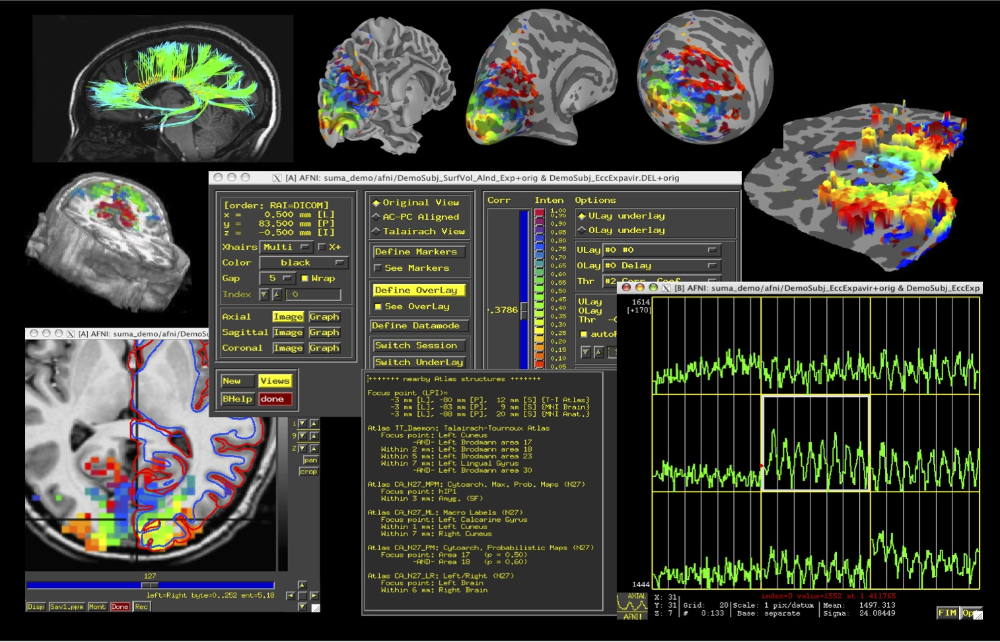
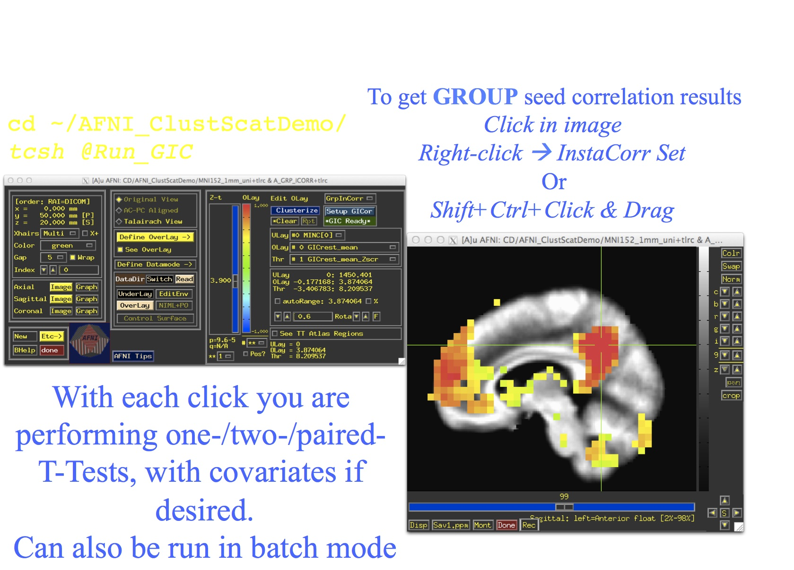
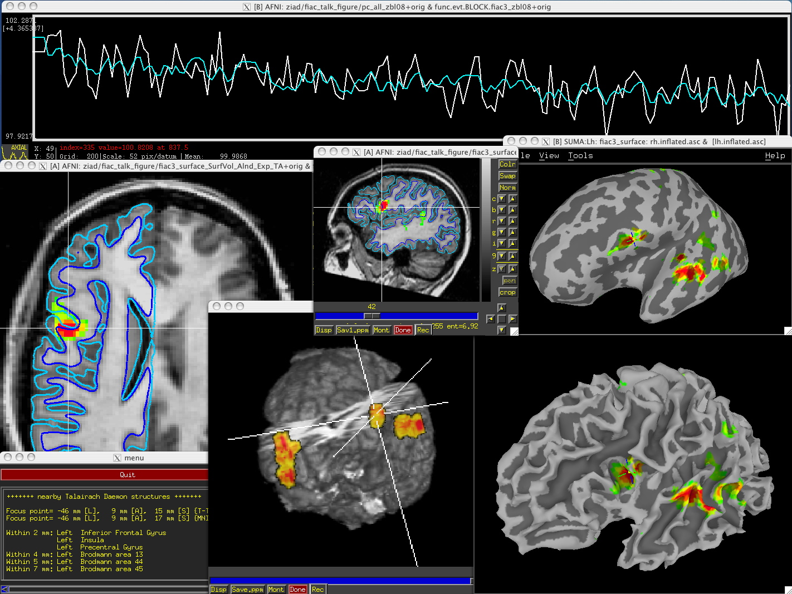

.. _cover:

*****
Intro
*****

.. _voxel-based:

AFNI (Analysis of Functional NeuroImages) is a suite of programs that will bring joy to your data http://afni.nimh.nih.gov whether at the single level or group level. 

.. _cover-figure:

   
   :ref:`Days of yore<cover-figure>`
   

.. _highlights:

Highlights
==========

InstaCorr
---------

   
   :ref:`(link)<media/icorr.jpg>`

Single-subject analysis
-----------------------

Words here.

   
   :ref:`(link)<media/single_subject.jpg>`
   
.. container:: clearer
   
   .. image:: media/blank.jpg
   
Pipeline
--------

An uber_subject blurb.

   
   :ref:`(link)<media/single_subject.jpg>`
   
.. container:: clearer
   
   .. image:: media/blank.jpg
   

Freehand ROI drawing in any viewer. See :ref:`drawing_ROIs`.

Atlases
-------

etc.

Automation of GUI behavior
--------------------------

You can automate the majority of tasks normally performed interactively... See demo scripts **@DriveSuma**, **@DriveAfni**, and **@DO.examples** available in the AFNI `distribution <http://afni.nimh.nih.gov/afni/download/afni/releases/latest>`_.
   
    
