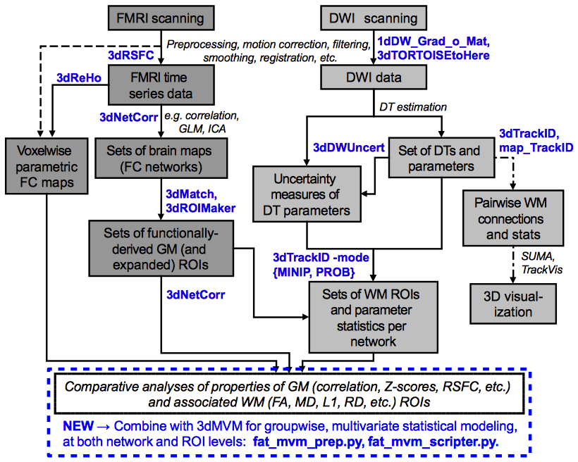

.. _FATCAT_All:

***************
FATCAT Commands
***************

.. contents::
   :depth: 3

Overview
========

The Functional And Tractographic Connectivity Toolbox (FATCAT)
contains several programs for processing and analyzing MRI data, in
particular combining FMRI and diffusion-based data.  The programs are
designed to work straightforwardly with other analysis tools in the
rest of AFNI and SUMA (as well as with other distributions).
Moreover, it has already and continues to grow in functionality based
on ongoing studies and, importantly, user suggestions.  Present
capabilities include:

* calculating resting state functional connectivity (RSFC) parameters
  such as ReHo, ALFF, fALFF, RSFA, etc. **(3dReHo, 3dRSFC)**;
* calculating correlation matrices among networks of ROIs and/or whole
  brain connectivity maps **(3dNetCorr)**;
* converting FMRI and other data into networks of target ROIs for
  tractography **(3dROIMaker)**;
* estimating matching volumes between sets of data **(3dMatch)**;
* simple DW gradient manipulation (converting columns, rows, and
  b-matrices; translating between AFNI, TORTOISE and other package
  conventions; flipping gradient components) as well as simultaneously
  processing DWI data (combining b=0 volumes; averaging repeated DWIs)
  **(1dDW_Grad_o_Mat, 3dTORTOISEtoHere)**;
* performing deterministic, mini-probabilistic and full probabilistic
  tractography in a fairly efficient manner and with particular
  interest in networks of target ROIs, such as functional networks or
  connectomes **(3dTrackID, 3dDWUncert)**;
* user-interactive tracking investigation **(via SUMA and AFNI)**.
* generating simulations of Rician-noised data **(3dDTtoNoisyDWI)**;
* statistical analysis on a group level: modeling network connectivity
  (functional or structural) with subject data (e.g., ages, test
  scores, etc.) using 3dMVM **(fat_\*.py)**;
* selection of rows and viewing/saving of output matrices (\*.grid and
  \*.netcc files) **(fat_roi_row.py, fat_mat_sel.py)**.

   
   *A schematic overview of available FATCAT tools (in blue).* :ref:`(link)<media/FAT_overview.jpg>`

Announcements of updates, fixes and new programmation are made and
recorded on the AFNI `Message Board
<http://afni.nimh.nih.gov/afni/community/board/>`_. This is a useful
resource for checking on previously asked (and hopefully answered)
questions that come up during analysis.  It is also a good first port
of call for asking new questions that you yourself might have.

.. note:: This documentation aims to be a complement to the programs'
          helpfiles and demo scripts.  It is written in a different
          style, hopefully taking advantage of the ability to include
          graphics and images to clarify \{e,al,il\}lusive points and to
          make examples. If there are any suggestions to increase
          clarity, to include further examples or to fix tyypographic
          errors, please notify the authors.

|

.. _DEMO_Definitions:

Demo data sets and scripts
==========================

Demo sets are provided for getting acquainted with FATCAT
capabilities. Each demo set contains both data and scripts-- the
latter generally useful descriptions and musings in comments, so they
are worth reading when executing the commands. The scripts may provide
a useful basis for starting to build pipelines.

Demo sets are most easily obtained via command line. To download and
install the primary FATCAT_DEMO, run the following in a terminal::

   @Install_FATCAT_DEMO

Further online documentation (with pictures!) is provided at the
:ref:`FATCAT_Demo` page.

To download and install the recent demo on combining FATCAT analysis
with AFNI's 3dMVM capabilities (useful for group-level modeling of
network properties), run the following in a terminal::

   @Install_FATMVM_DEMO

Further online documentation for this is forthcoming...

Other
=====

Currently, *preprocessing* steps (such as corrections for outliers,
subject motion, induced eddy currents and magnetic susceptibility) are
not treated in FATCAT.  For these things, one might use, for example,
`TORTOISE
<https://science.nichd.nih.gov/confluence/display/nihpd/TORTOISE>`_.

Additionally, tracking capability includes both single
direction-per-voxel (i.e., DTI-based) and multiple direction-per-voxel
(i.e., HARDI-based) methodology. While AFNI contains 3dDWItoDT to
estimate diffusion tensors and parameters, it currently does not
possess a HARDI modeller itself. There are several other programs
available for estimating the main directions of tract propagation,
though the degree of integrability with FATCAT may vary. One example
of using `DSI-Studio <http://dsi-studio.labsolver.org/>`_ to perform
HARDI modeling and converting the output to be 3dTrackID-able is
provided in the FATCAT demo:  ``FATCAT_DEMO/HARDI/do_dsistudio.tcsh``.

Notation Notes
==============

The aim of this documentation is to inform what tools are available
for data analysis, and to facilitate their use.  The hope is that the
notations involved in describing the code and making general examples
are clear.  Current format choices include:

* command line names are written in a font like this: ``Font``;
* references to *switches* in a command line program are written like
  ``-switch``, and these take no arguments after the option name;
* options that require arguments such as file names or numbers are
  written as ``-option_name *``, where the wildcard character '``*``'
  itself would not generally be typed-- it is used non-literally to
  reinforce that something else needs to be typed after the option
  name;
* some options take only specific keywords as arguments. The set of
  keys will be presented in curly-brackets "\{...\}" with elements
  separated by a vertical line "|". When described, those will often
  be presented in the following format, ``-option_name
  {KEY1|KEY2|KEY3|...}``, by which the user is expected to select only
  one key when actually calling the option in the command line (e.g.,
  ``-option_name KEY2``);
* in command line examples, non-literal filenames are typed in
  all-capital letters with descriptive words separated by the
  underscore character '_', such as ``ROI_FILE``;
* in command line examples, non-literal numerical arguments would be
  held by a single capital letter, such as ``X`` or ``Y``.

