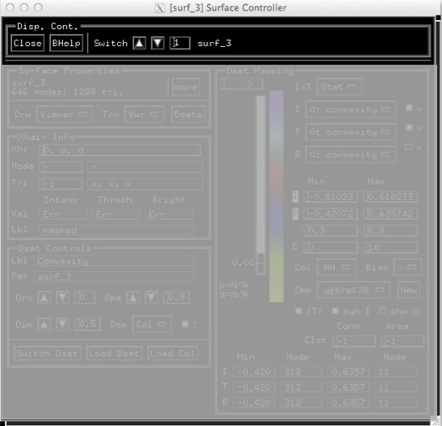

.. _ObjectControllers:

===================
Object Controllers:
===================

.. _Controller_Notebook:

The Controller Notebook:
------------------------

Many of the displayable objects, particularly those that can carry data, have an bject controller. Historically there was only surface-controllers but now volumes, tracts, and graphs also have their own controllers. To easiest way to open a controller is to select an object and open its controller with :kbd:`ctrl+s`, or :menuselection:`View --> Object Controller`. Once a controller is open, selecting other objects automatically creates their own controller. All object controllers are grouped in one notebook window as shown in :ref:`Object Controller <object_controller_notebook>`.

.. _object_controller_notebook:

      
   Object Controller Notebook: Holder of all controllers. Grayed out area will be different for different object types.
   
Once you select an object, its controller is popped to the top. You can also use the :ref:`Switch <GL_CN_Switch>` to get at the controller for an object that you don't want to select or that is simply out of reach (invisible). 

Disp. Cont.:
============

A few controls for the object controller notebook.

   .. _GL_CN_Close:

   :guilabel:`Close`: Close controller. Settings are not lost. You can bring it back with :ref:`Ctrl+s <LC_Ctrl+s>` key.
   
   .. _GL_CN_BHelp:
   
   :guilabel:`BHelp`: Obtain context specific help by clicking on this button then clicking on the contextfor which you want information.
   
   .. _GL_CN_Switch:
   
   :guilabel:`Switch`: Switch between controller notebook pages. You can use the arrows to cycle between pages or set the page number directly. 

.. include:: auto_inc/SurfCont_help.inc 
.. include:: auto_inc/TractCont_help.inc 
.. include:: auto_inc/VolCont_help.inc 
.. include:: auto_inc/GraphCont_help.inc

