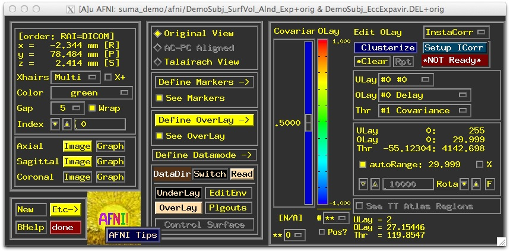

.. _viewer:

***********
SUMA Viewer
***********

.. _Surface_Viewing:

Surface Viewing
===============
This is a walk through the basics of surface navigation. To follow along you will need the :ref:`suma_demo` directory installed. 

To begin we go into the demo directory and launch *suma* and *afni* with the following commands::

   cd suma_demo/afni
   afni -niml &
   tcsh run_suma &
   
.. note::
   
   The script *run_suma* does little more than launch *suma* with the command::

      suma  -spec ../SurfData/SUMA/std.DemoSubj_both.spec        \
            -sv DemoSubj_SurfVol_Alnd_Exp+orig 

You should have *AFNI* up by now, and *SUMA* soon after. 

.. figure:: media/surfview.0000.jpg
   :align: right
   :figwidth: 30%
   
   
.. figure:: media/surfview.0001.jpg
   :align: left
   :figwidth: 30%

.. container:: clearer
   
    .. image:: media/blank.jpg
   
   
   
Quick Tour
----------

   1. Talking to AFNI
   
      * Press :ref:`t <LC_t>` in the suma window to talk to *AFNI*
         
         * This sends anatomically correct surfaces to AFNI
      
      * You should be seeing surface contours atop the slices
      
         * Contours are the intersection of the surface with the slice
         
            * You could also see boxes representing the nodes that are within +/-1/2 slice from the center of the slice in view.

            * Colors and node box visibility can be changed to suit your desires from the :guilabel:`Control Surface` button in *AFNI*.

            .. figure:: media/surfview.0003.jpg
               :align: right
               :figwidth: 40%
               
      * Navigate through the volume in *AFNI*
      
         * Make sure you have an excellent alignment between volume and surface
         
         * Make sure surface adequaetly represents areas of the brain that are difficult to segment
         
            * occipital cortex
            
            * inferior frontal and inferior temporal regions
            
         * Surface may look good in *SUMA*, but may not match anatomy in some places -- this is why you check surfaces in the AFNI display.
         
         .. note:
         
         * The :term:`Surface Volume` and the surfaces must be in nearly perfect alignment.
         
            * If you have an improper alignment, it should be addressed here and now.
               * This should not happen for FreeSurfer and SureFit/Caret surfaces created in the standard fashion with :ref:`@SUMA_Make_Spec_FS` or :ref:`@SUMA_Make_Spec_Caret`, say. Problems might come up when you attempt to align data across days with :ref:`@SUMA_AlignToExperiment`. See also :ref:`Align_Surf_Vol`
               
            * Watch for error messages and warnings to come up in the shell as all the surfaces are read in. These messages should be examined once per subject since they do not change unless the surface's geometry or topology is changed.
            
            * Viewed without the volume underal, it is extremely difficult to tell if surface models with no topological defects accurately represent the cortical surface.
            
            
   2. Rotating the surface
   
      * :ref:`Button 1 drag<Button_1-Motion>`: keep it down while moving the mouse left to right. This rotates the surface about the screen's Y-axis (dotted green if :ref:`screen axes<F2>` are displayed). Let go of button-1 (usually the left button).
      
      * Repeat with up and down motion for rotation about X-axis and motion in various directions for rotations mimicking those of a trackball interface.
      
      * Also try :ref:`up/down <U-D_arrows>`, :ref:`left/right <L-R_arrows>` arrow keys.
         * Arrow keys rotate by increments specified by the unix environment variable :ref:`SUMA_ArrowRotAngle<SUMA_ArrowRotAngle>` in degrees.
         
         * You can set SUMA environment variables in file ~/.sumarc. See also option :ref:`-update_env<suma--update_env>` in *suma*.
   
.. _Prying:

   3. Prying & Z rotating the hemispheres
   
      * :ref:`Ctrl+button-1, drag<Ctrl+Button_1-Motion>`: Moving the mouse horizontally while button 1 is pressed and ctrl is down will pry hemispheres apart for better visualization. The prying behavior is different for spherical and flattened surfaces. Better try it than read about it. See also :ref:`F10 <F10>`
      
      .. figure:: media/surfview_pry3.jpg
         :align: center
      
      .. figure:: media/surfview_pry3b.jpg
         :align: center
      
      .. container:: clearer
   
         .. image:: media/blank.jpg
   
         
         * :ref:`Ctrl+button-1 double click <Ctrl+Button_1-DoubleClick>`: Undo prying.
      
      * :ref:`Shift+button-1 drag<Shift+Button_1-Motion>`: Rotate surfaces about screen's Z-axis. This option is useful for positioning flat surfaces when displayed one at a time. In most other circumstances, it leads to confusion.
      
         * :ref:`Shift+button 1 double click<Shift+Button_1-DoubleClick>`: Undo Z rotation
         
      * Translating surfaces
      
         * :ref:`Button-2 drag <Button_2-Motion>`:  keep it down while moving the mouse to translate surface along screen X and Y axes or any combinations of the two.
         
         * Also try :ref:`Shift+arrow <Shift+L-R_arrows>` keys.
         
      * Zooming in/out
      
         * Both :ref:`Buttons 1&2 or Shift+button2 <Shift+Button2-Motion>`: while pressing buttons, move mouse down or up to zoom in and out, respectively.
         
         * Also try keyboard buttons :ref:`Z<UC_Z>` and :ref:`z<LC_z>` for zooming in and out, respectively.

.. _Picking_Node:
.. _Picking_Faceset:
         
      * Picking a Node or a Facet:
      
         * :ref:`Button 3 <Button_3-Press>`: press over a location on a surface to pick the closest facet and node to the location of the pointer.

             *   The closest node is highlighted with a blue sphere
             
             *   The closest facet is highlighted with a gray triangle
         
            .. figure:: media/surfview.0010.jpg
               :align: right
               :figwidth: 20%
               :target: ../_images/surfview.0010.jpg
               
         * Note the information written to the shell regarding the properties of the picked Node and Facet.
         
         * When connected to *AFNI* (after having pressed :ref:`t <LC_t>`), watch the AFNI crosshair jump to the corresponding location in the volume.
         
         * Conversely, position the crosshair in AFNI (a left click there) at a position close to the surface and watch the crosshari relocate in SUMA.
         
         * You can swap buttons 1 & 3's functions using the environment variable :ref:`SUMA_SwapButtons_1_3<SUMA_SwapButtons_1_3>`
      
      * Cardinal views (along coordinate directions)
      
         * :ref:`Ctrl+Left/Right <Ctrl+L-R_arrows>`: Views along LR axis
         
         * :ref:`Ctrl+Up/Down <Ctrl+U-D_arrows>`: Views along SI axis
         
         * :ref:`Ctrl+shift+Up/Down <Ctrl+Shift+U-D_arrows>`: Views along AP axis
         
         .. figure:: media/surfview_card.jpg
            :align: right
            :figwidth: 20%
            :target: ../_images/surfview_card.jpg
               
      * Resetting the view point
      
         * Press :ref:`Home(fn+left arrow macs)<HOME>`  to get back to the original vantage point.
         
         * :ref:`view->save <Save_View>` and :ref:`view->load <Load_View>` to save load views
         
      * Momentum feature
      
         * Press :ref:`m<LC_m>` to toggle momentum on. Click the left mouse button and release it as you are dragging the mouse. It should feel like you're throwing the surface.
         
      * Lots more
      
         * Function keys modify various aspects of the display
         
            * Those may be usurped by OS X, see Keyboard Setup or try key modifiers to get them to work.
            
         * See *SUMA*\ 's :ref:`help<LC_Ctrl+h>` or :ref:`Keyboard Controls <KeyboardControls>` for all interactive options.
         

.. _Recording_Images:

   4. Recording your images
  
      * Press :ref:`r<LC_r>` in the viewer to record the current scene. The image is captured in an AFNI flavored window. Successive record commands get saved in the same viewer.
        
         .. note::
         
            The record viewer acquires a GUI interface the moment it has more than one image in it. The interface is the same as that in AFNI. If you want to save a single captured image to disk, use 'Alt+Right Click' in the recorder window to pop a save menu which allows you to enter prefix of the image and more.

            When more than one image are captured in the recorder, you have numerous options to control the recording process. Consider turning off :menuselection:`Disp->Save One` to record multiple images in one pass. This changes the save button from :menuselection:`Sav1.jpg` to :menuselection:`Save.jpg`. If you've read this far, you should stop reading and try it for yourself.

            .. figure:: media/surfview.0015.jpg
               :align: right
               :figwidth: 20%
               :target: ../_images/surfview.0015.jpg

      * Press :ref:`r<LC_r>` on the **colorbar** of the :ref:`surface controller<SurfCont>` records an image of the colorbar.
      
      * Press :ref:`R<UC_r>` to record continuously from the viewer. Doing so puts the viewer in :term:`Recording Mode` where any operation that causes a change in the rendered image is directly captured in the recorder.
      
         * Identical consecutive images are rejected
         
         * Images caused by window expose events are ignored
         
         * If you let the recorder run continuously with very large images, you might quickly run out of memory on your computer.
         
      * Use :ref:`Ctrl+r<LC_Ctrl+r>` to capture the image directly to *disk* intead of to the recorder.
      
      * Similarly, :ref:`Ctrl+R<UC_Ctrl+R>` records continuously to *disk*
           
      * You can save/load viewer setting used to create a figure with :ref:`File->Save View<Save_View>` / :ref:`File->Load View<Load_View>`
      
      
         
.. _Volume_Viewing:

Volume Viewing
==============
         
.. _Tract_Viewing:

Tract Viewing
=============
    
.. _Graph_Viewing:

Graph Viewing
=============

.. _Displayable Objects:

Displayable Objects
===================

Show directions for example, show surface based normals, explain how you can hide some, etc. Link to other demos

.. _ECOG_Grid_Viewing:

ECOG Grid Viewing
=================

     
.. _ Mouse+Keyboard:

Mouse & Keyboard
================

.. include:: auto_inc/Mouse_Keyb_help.inc

.. include:: auto_inc/Mouse_Cmap_Keyb_help.inc

.. _ObjectControllers:

.. _ColorMixing:

Color Mixing
============

.. _Color_Plane_Grouping:

Color Plane Grouping
--------------------
Colorized Dsets are organized into layered color planes
   2 commonly used planes are:
      Surface Convexity (usually in gray scale) 
      AFNI Function (usually in color)
   Planes are assigned to two groups
      Background planes (like Convexity)
      Foreground planes (like AFNI Function)
      Many other planes can be added to either group.
Color planes of the same group are mixed together:
   Planes are stacked based on their order and opacity.
   Opacity of 1st plane in a group does not affect color mixing.
   There are 2 modes for mixing colors. See :ref:`F7 <F7>` key in SUMA.

.. _opacity_01:

.. figure:: media/opacity_01.jpg
   :align: center
      
   
.. _Plane_Layering:
   
Layering fore- & background planes
----------------------------------   
      To demonstrate the layering of foreground and background planes, start with a view of an inflated surface with come color overlay such as you would get from talking to AFNI. Requires :ref:`suma_demo <suma_demo>`
      
      .. figure:: media/collayer.0000.jpg
         :align: center
      
      ..
      
      Turn foreground plane(s) off by pressing :ref:`f <LC_f>` once   
         Now all you see is the background plane(s)   
      
      .. figure:: media/collayer.0001.jpg
         :align: center
      
      Turn background planes off by pressing :ref:`b <LC_b>` once   
         Now all you see is "No Color" color on all nodes   
      
      .. figure:: media/collayer.0002.jpg
         :align: center
      
      Turn foreground plane(s) back on with :ref:`f <LC_f>`   
         Now you have foreground without background   
         
      .. figure:: media/collayer.0003.jpg
         :align: center
         
      Turn background plane(s) back on with :ref:`b <LC_b>`  
         Now you have foreground atop background   
         You can still see the background underneath the foreground -- this is due to the background brightness attenuation of the foreground colors.
            
      Toggle background intensity attenuation off and on with :ref:`a <LC_a>` and see the effect on the resultant maps.
      
      .. figure:: media/collayer.0004.jpg
         :align: left
         
      .. figure:: media/collayer.0000.jpg
         :align: center

.. _Color_Plane_Opacity:

Playing with color plane opacity
--------------------------------
   Continuing with the demo surfaces and pre-existing color planes (datasets)...
   
   Open surface controller with :ref:`ctrl+s <LC_Ctrl+s>` or :menuselection:`View->Surface Controller`
      Turn OFF :ref:`1 <SurfCont->Dset_Controls->1>`
   Load in color plane :file:`lh.1D.col` using :ref:`Load Col <SurfCont->Dset_Controls->Load_Col>` or :ref:`c <LC_c>`
      This is an RGB Dset, so color mapping controls are hidden 
      Plane is placed atop of the foreground group
      Its opacity is 1 so it will obsucure the functional data
      
      .. figure:: media/colop.0000.jpg
         :align: center
      
      ..
      
      Background attenuation is not affected by plane's opacity
         try turning it on and off again with :ref:`a <LC_a>`
         
      .. figure:: media/colop.0001.jpg
         :align: center
      
      Now lower the opacity of :file:`lh.1D.col` with :ref:`Opa <SurfCont->Dset_Controls->Opa>` and watch the colors from the planes below start to show through
      
      .. figure:: media/colop.0003.jpg
         :align: left

      .. figure:: media/colop.0002.jpg
         :align: center

      |
      
      .. That | above is to put a line break after figure and avoid messing up the centering of the heading below.
      
Playing with color plane order
------------------------------
   Continuing with the examples above, with inflated view and function from AFNI displayed on the surfaces...
   
   We will push dataset from :file:`lh.1D.col` below the function from AFNI
      Use :ref:`Switch Dset <SurfCont->Dset_Controls->Switch_Dset>` to get a list of available planes
      Prefixes *fg:* and *bg:* denote plane's group membership
      Select *lh.1D.col* and lower its order with the :ref:`Ord <SurfCont->Dset_Controls->Ord>` button
      Select *FuncAfni_0* and play with its opacity
      Note: You can't make a plane change its group membership, yet.
      
   You can't delete a loaded color plane yet, but you can reload it if it changes on disk, or you can hide it with :ref:`Dsp <SurfCont->Dset_Controls->Dsp>`.
   
   Turn :ref:`1 <SurfCont->Dset_Controls->1>` ON if you just want to see the selected plane with no blending business from other planes.
      The plane displayed would be the one whose label is shown in the surface controller.
      
   Test!
      Find a way to flip between the mapping from AFNI and the mapping done with `3dVol2Surf <http://afni.nimh.nih.gov/pub/dist/doc/program_help/3dVol2Surf.html>`_ on the command line with script :file:`run_3dVol2Surf`.
         Appreciate the differences between the two mappings.
         

.. _Align_Surf_Vol:

Alignment of Surfaces with Volumes
==================================

.. _Spec_File:

The Spec File
=============

The Spec file contains information about surfaces that will be available to a program.
   
   * Information is specified in the format: **field = value**
   
   * The **=** sign must be preceded and followed by a space character.
   
   * **#** delimit comment lines, empty lines and tabs are ignored.
   
   * In addition to fields, there is also the :ref:`NewSurface <Spec_NewSurface>` tag which is used to announce a new surface.
   
   * Unrecognized text will cause the program parsing a Spec file to complain and exit.
   
   * See programs :ref:`quickspec<quickspec>` and :ref:`inspec<inspec>` for manipulations of spec files.
   
   * Here is a sample spec file::
   
      # delimits comments 
      # define the group
         Group = DemoSubj
      
      # define various States
         StateDef = smoothwm
         StateDef = pial
         StateDef = inflated
         
      NewSurface
         SurfaceFormat = ASCII
         SurfaceType = FreeSurfer
         FreeSurferSurface =
         lh.smoothwm.asc
         LocalDomainParent = SAME
         SurfaceState = smoothwm
         EmbedDimension = 3
      
      NewSurface
         SurfaceFormat = ASCII
         SurfaceType = FreeSurfer
         FreeSurferSurface = lh.pial.asc
         LocalDomainParent =
         lh.smoothwm.asc
         SurfaceState = pial
         EmbedDimension = 3
      
      NewSurface
         SurfaceFormat = ASCII
         SurfaceType = FreeSurfer
         FreeSurferSurface = lh.inflated.asc
         LocalDomainParent = lh.smoothwm.asc
         SurfaceState = inflated
         EmbedDimension = 3
      
      NewSurface
         SurfaceFormat = ASCII
         SurfaceType = FreeSurfer
         FreeSurferSurface = lh.sphere.asc
         LocalDomainParent = lh.smoothwm.asc
         SurfaceState = sphere
         EmbedDimension = 3
   
   * Fields of the Spec File:
   
      .. _Spec_Group:
      
      * *Group*\ : Usually the Subject's ID. In the current SUMA version, you can only have one group per spec file. All surfaces read by SUMA must belong to a group.
      
      .. _Spec_NewSurface:
      
      * *NewSurface*\ : A tag announing the beginning of a set of fields for a new surface.
       
      .. _Spec_FreeSurferSurface:
      .. _Spec_SurfaceName:
      
      *  *SurfaceName* or *FreeSurferSurface*\ : Name of the surface file.
      
      .. _Spec_SurfaceFormat:
      
      *  *SurfaceFormat*\ : ASCII or BINARY
      
      .. _Spec_SurfaceType:
      
      *  *SurfaceType*\ :  FreeSurfer, Caret, BrainVoyager, Ply, etc.
      
      .. _Spec_SurfaceState:
      
      *  *SurfaceState*\ : Surfaces can be in different states such as inflated, flattened, etc. The label of a state is arbitrary and can be defined by the user. The set of available states must be defined with :ref:`StateDef<Spec_StateDef>` at the beginning of the Spec file.
      
      .. _Spec_StateDef:
      
      *  *StateDef*\ : Used to define the various states. This must be placed before any of the surfaces are specified.
      
      .. _Spec_Anatomical:
      
      *  *Anatomical*\ : Used to indicate whether surface is anatomically correct (Y) or not (N). Anatomically correct surfaces are sent to AFNI.
      
      .. _Spec_LocalDomainParent:
      
      *  *LocalDomainParent*\ : Name of a surface whose mesh is shared by other surfaces in the spec file.
      
         *  The default for FreeSurfer surfaces is the smoothed gray matter/ white matter boundary. For SureFit it is the fiducial surface. Use SAME when the LocalDomainParent for a surface is the surface itself.
      
      .. *  A node-to-node correspondence is maintained across surfaces sharing the same domain parent.
      
      .. _Spec_EmbedDimension:
      
      * *EmbedDimension*\ : Embedding Dimension of the surface, 2 for surfaces in the flattened state, 3 for other.
      
      
