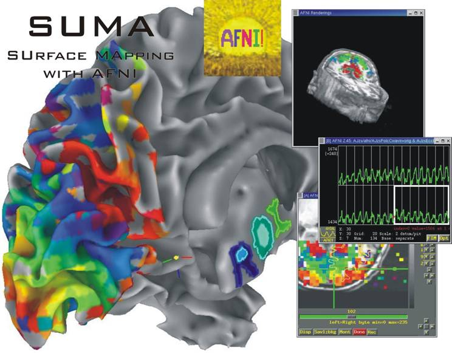

.. _cover:

======================
SUMA (SUrface MApping)
======================

.. _surface-based:

SUMA is a program that adds cortical surface based functional imaging analysis to the AFNI suite of programs http://afni.nimh.nih.gov . SUMA allows 3D cortical surface renderings, the mapping of volumetric data onto them and, surface based computations and statistical inferences. 

.. _cover-figure:

      
.. _connectivity-data:

SUMA also allows display and manipulation of matrices for various flavors of connectivity data, tractography results from AFNI's FATCAT toolbox, and the rendering of volumetric data.

.. _HBM14_01:
  
.. figure:: media/image_HBM14_01.jpg
   
   Whole brain deterministic tractography with AFNI-FATCAT as rendered with SUMA. Surface models, here shown with transparency, are pried apart to reveal internal structures.

.. _HBM14_04:

.. figure:: media/image_HBM14_04.jpg
   
   **A**.Rendering of matrix data as a 3D graph. **B**.Graph edges represented by bundles. **C**.Matrix representation of connectivity data

