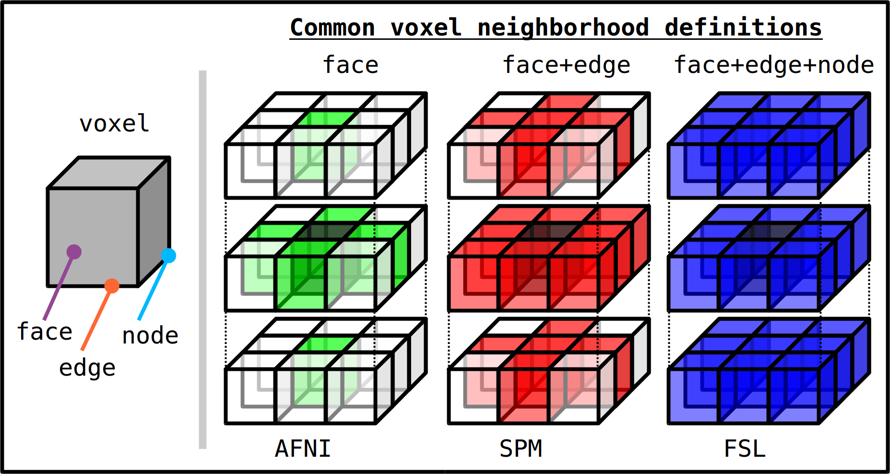

.. _Making_ROIs:

*****************************************
Making (networks of) ROIs: **3dROIMaker**
*****************************************

.. contents::
   :depth: 3

Overview
========

There are many contexts for making one or more regions of interest
(ROIs) in MRI:

* forming functional (GM) networks,
* preparing targets (bordering on WM) for tractography,
* preparing theoretical studies,
* parcellating the whole brain or cortex for connectomics,

and more.  In each case, the details of the ROI-making procedure
depend on what inputs are available and on what the resulting analysis
will be.  However, the primary purpose of the process is typically the
same: to delineate brain regions which are as physiologically
meaningful and relevant as possible.

The program ``3dROIMaker`` is designed to be useful in extracting
regions from subject data itself, with the ability to combine
information from several modalities. Reference templates may also be
included for extra guidance.  Given the prominence of *networks* in
modern brain research, the focus of this program is to allow for
(hopefully) easy regionalization of data maps, such as listed
about. ``3dROIMaker`` can also be applied to multibrick data sets
simultaneously, as several other AFNI programs (e.g., ``3dNetCorr``
and ``3dTrackID``) can analyze networks simultaneously, with each one
defined as a separate brick.

|

Operation
=========

For historical reasons, the terminology of several ``3dROIMaker``
option names and descriptions comes from a scenario where the input
image is FMRI-related and one is looking to extract GM ROIs, while
perhaps using CSF and WM to eliminate voxels and/or inform ROI
inflation.  However, the functionality (masking, thresholding, etc.)
can be applied generally to any type of input and supporting
data. Hopefully this naming convention does not create confusion.

Broadly, ``3dROIMaker`` can be used to:

* threshold input images, in order to define a set of individual
  regions, which are sometimes colloquially referred to as *blobs*
  (``-thresh *``):

  * thresholding can be further refined to keep a set of
    maximal-valued voxels per ROI (``-only_some_top *``);

* subtract away other maps (e.g., tissue-defined skeletons) from the
  input images:

  * subtraction can be done before or after thresholding the input
    image (``-csf_skel *``, ``-wm_skel *``, ``-trim_off_wm``);
  * an other map can itself be thresholded from the command line
    (``-skel_thr *``);

* eliminate blobs based on a volume threshold (``-volthr *``);
* uniformly inflate blobs (``-inflate *``):

  * for a given network (brick) of regions, the epansion is done layer
    by layer, aiming to limit biases among growing ROIs;
  * inflation can be controlled to stop at boundaries of guiding maps
    (``-skel_stop``).

* numbering of thresholded ROIs can be guided by a reference set, to
  keep similar regions in different data sets having the same integer
  or text labels (``-refset *``);

* perform 'preinflation', which was designed for a special case
  of*starting* with an input WM map, then expanding to GM and
  subtracting away the WM, and finally using the generated GM ROIs for
  further expansion, thresholding, etc. (``-preinfl_inset *``,
  ``-preinfl_inflate *``)

Each ROI is defined as a set of voxels with a given nonzero integer
value within dataset volume (what is referred to as its **integer
label**).  Typically, the integers are >0, though for tractography
purposes, negative voxel values show where *anti-masks* that exclude
tracts are located.  Additionally, this information can be combined
with (NIML-formatted) labeltables to allow for text-labels to be
associated with each ROI. These labeltable names can track through to
further analysis programs, such as ``3dNetCorr`` and ``3dTrackID``.  

**Important notes**
-------------------

#.  When ROIs are being inflated, they will not write over other ROIs
    in the same brick. Thus, a network of ROIs should always be
    inflated while in the same brick, for greater consistency, rather
    than inflated individually and 'summed' together.

#.  In general, it should be possible to do much of the ROI processing
    (inflating, threshold, etc.) with all the network ROIs in a single
    brick, rather than individually.  This should hopefully lead to
    both greater time-saving, as well as consistency within the
    output. If the below notes, examples or existing `Message Board
    <http://afni.nimh.nih.gov/afni/community/board/>`_ posts don't
    help to keep analysis scripts short, then please enquire before
    spending ages on complicated pipelines.

#.  If mapping ``3dROIMaker``\-produced output files to another space
    (for example, from standard to DTI), then one can make sure that
    the integer-nature of the files is preserved when applying the
    transform.  One can use the ``-interp NN`` option when applying
    linear transforms (``3dAllineate``), or likely ``-ainterp NN``
    after nonlinear transforms (``3dNwarpApply`` following
    ``3dQwarp``).

#.  If the input dataset *already* has integer labels that the user
    wishes to preserve, then one should enter the same dataset as a
    reference set::

      3dROIMaker -inset FILE_A -refset FILE_A ...

    This action will preserve labels even if some of the ROIs are
    contiguous, such as is likely to occur in the case of a
    :ref:`ROI_Example_Connectome`.

#.  When an aim of using `3dROIMaker` is to produce target regions for
    tractography, then the inflation should be performed in diffusion
    space, where one can use the actual WM proxy map (such as FA>0.2)
    to delimit inflation.

    This may lead to scenarios where multiple iterations of
    `3dROIMaker` are called for. For example, one may threshold a
    group map of functional data and get rid of tiny/noisy regions,
    and then transform the networks to each individual's diffusion
    space, in order to perform the ROI inflation there (as well as the
    eventual tractography).

|

Multiple bricks and multiple networks
-------------------------------------

Each input brick in an ``-inset *`` file is treated as a separate
network in terms of expansion, skeleton subtraction, and default
integer labeling.

If an input file has *N* bricks, then an input ``-refset *`` file (for
applying user-defined ROI integer labels) can have either 1 or *N*
bricks.  In the former case the same integer labels are applied to
each brick, and in the latter the *i*\ th brick in the reference set is
applied to the *i*\ th brick in the input set.

Currently, when an input dat set has a single NIML-formatted
labeltable (\*.niml.lt) attached to it, the labels are applied to each
brick.  That is, there are not subsets of labels applicable to
different bricks.

.. _ROI_info_Neighbors:

Getting to know your neighbors
------------------------------

An important consideration in determining ROIs is how a *neighborhood*
is defined at a voxel level. For most applications, these are
symmetric around a given voxel (though, near the edge of a dataset or
mask it may be clipped).  The categories are typically described in
terms of what basic features must be shared in order to make two
voxels neighbors: nodes, edges or faces.

Different software packages have different default definitions of a
voxel neighborhood.  The three main categories are:

* face only (6 neighboring voxels);
* face+edge (18 neighboring voxels);
* face+edge+node (26 neighboring voxels).

Depictions of ways of defining voxel neighborhoods are shown below;
listed for each are examples of basic software distributions using the
given method as a typical default:

   
   *Basic voxel terminology, and its use in defining three standard,
   symmetric (nearest-)neighborhoods for an individual voxel. The
   central voxel is darkened, with each type of neighborhood colored
   in a 3D, high-tec, separated image.* :ref:`(link)<media/ROIS/ROI_neigh_img.png>`

For example, the default in each of AFNI's ``3dClustSim`` and the
Clusterize function is a face-wise neighbor definition. The same is
currently true for ``3dROIMaker``, and one can use other methods by
implementing switches:

* for face+edge (18 neighbors), use ``-neigh_face_edge``;
* for face+edge+node (26 neighbors), use ``-neigh_upto_vert``.

.. note:: Even though an overall software distribution has a general
          method for defining voxel neighborhoods, individual programs
          themselves may differ or vary over time. For example
          ``3dROIMaker`` started life using a face+edge neighborhood
          default. Therefore, it is advisable to always check a given
          program for notes regarding neighborhoods.

As a slightly related appendix to this discussion, we note that some
programs define ROI neighborhoods in terms of a 'cluster radius'
(generally in units of 'mm').  In such a system, when measuring from
the center of the focal voxel, all voxels whose centers are within the
specified radial distance are included in the neighborhood. For
instance, AFNI's AlphaSim does this with the ``-rmm *`` option.  In
the case of isotropic voxels (all edges of the same length, *L*), this
system meshes with the above by setting the radius to be:

* 1.1\ *L*, for face only;
* 1.7\ *L*, for face+edge;
* 1.9\ *L*, for face+edge+node.

These values are not exclusive, but they should work fine.

|

Using anatomical tissues and diffusion maps
===========================================

For this example, the input data is a seed-based correlation map
(Pearson *r* values) of resting state FMRI data, where the seed voxel
was located in the posterior cingulate cortex, a known part of the
default mode network. We look at a few ways of including tissue
information from anatomical/structural data, namely that of a
T1-weighted (T1w) image and DTI parameter maps, when parcellating a
dataset into a network of ROIs.

There are several ways of doing using the T1w and DTI data, greatly
dependent on things like the user's goals for final analyses, quality
of data, etc. One may be interested in many things, such as:

* functional correlation matrices among ROIs with high functional
  connectivity (which is usually defined as *r*> some threshold); or,
* further restriction of the functional ROI voxels to be in a GM mask;
  and/or
* inflation of these GM ROIs to the nearest WM for tractography; and
  then likely
* restriction of the inflation using tissue information to find only
  associated 'local' WM.

Here, the T1w image has been skull-stripped and segmented into major
tissue types (CSF, GM and WM).  Because some of the goals might
include linking the functional data to tractographic analysis, both
the functional correlation map and the T1w tissue masks have been
mapped to native diffusion space. Thresholded functional correlation
maps are shown in the following figure, overlaid on diffusion (first
column) and tissue segmentation masks (second column; WM, CSF and GM
in order of decreasing brightness):

.. list-table:: 
   :header-rows: 1
   :widths: 50 50

   * - Correlation (*r*>0.4) map on *b*\=0
     - Correlation (*r*>0.4) map on tissue masks
   * - .. image:: media/ROIS_EX2/ax_corr04_on_b0.png
          :width: 100%
     - .. image:: media/ROIS_EX2/ax_corr04_on_tiss.png
          :width: 100%
   * - .. image:: media/ROIS_EX2/sag_corr04_on_b0.png
          :width: 100%
     - .. image:: media/ROIS_EX2/sag_corr04_on_tiss.png
          :width: 100%

In all the following cases, the same root is used for the
``3dROIMaker`` command, which employs a correlation map thresholding
of *r*>0.4, a volume thresholding of 100 voxels, an inflation of two
voxels, default neighborhood definitions (now AFNI-standard, facewise
voxel neighbors), and the whole brain diffusion mask::

  3dROIMaker                      \
      -inset SEED_CORRMAP+orig.   \
      -thresh 0.4                 \
      -volthr 100                 \
      -mask mask_DWI+orig.        \
      -inflate 2                  \
      ...

where possible continuations are given by the following variations:

.. note:: CSF must be input as a mask (i.e., a volume of all zeros or
          ones), and it does not restrict inflation.  WM may be input
          as a map, whose values can be thresholded (`-skel_thr *`)
          and used to restrict inflation (`-skel_stop`). Any WM and
          CSF skeletons can be cut away from the input map
          (`-trim_off_wm`) before regionalizing.

#. Use T1w-WM to stop inflation::

     ... -wm_skel tiss_WM_in_B0.nii.gz    \
         -skel_thr 0.5                    \
         -skel_stop                       \
         -prefix ROIMADE_WM

   .. list-table:: 
      :header-rows: 1
      :widths: 50 50

      * - \*_GM+orig\* images (10 ROIs)
        - \*_GMI+orig\* images
      * - .. image:: media/ROIS_EX2/ax_tiss_WM_GM.png
             :width: 100%
        - .. image:: media/ROIS_EX2/ax_tiss_WM_GMI.png
             :width: 100%
      * - .. image:: media/ROIS_EX2/sag_tiss_WM_GM.png
             :width: 100%
        - .. image:: media/ROIS_EX2/sag_tiss_WM_GMI.png
             :width: 100%

   |

#. Use T1w-WM first to trim away voxels and then to stop inflation::

     ... -wm_skel tiss_WM_in_B0.nii.gz    \
         -skel_thr 0.5                    \
         -skel_stop                       \
         -trim_off_wm                     \
         -prefix ROIMADE_WM_TRIM

   .. list-table:: 
      :header-rows: 1
      :widths: 50 50

      * - \*_GM+orig\* images (9 ROIs)
        - \*_GMI+orig\* images
      * - .. image:: media/ROIS_EX2/ax_tiss_WM_TRIM_GM.png
             :width: 100%
        - .. image:: media/ROIS_EX2/ax_tiss_WM_TRIM_GMI.png
             :width: 100%
      * - .. image:: media/ROIS_EX2/sag_tiss_WM_TRIM_GM.png
             :width: 100%
        - .. image:: media/ROIS_EX2/sag_tiss_WM_TRIM_GMI.png
             :width: 100%

   |

#. Start by trimming away T1w-WM and -CSF, and use the former to stop
   inflation::

     ... -wm_skel tiss_WM_in_B0.nii.gz    \
         -skel_thr 0.5                    \
         -skel_stop                       \
         -csf_skel tiss_CSF_in_B0.nii.gz  \
         -trim_off_wm                     \
         -prefix ROIMADE_WMCSF_TRIM

   .. list-table:: 
      :header-rows: 1
      :widths: 50 50

      * - \*_GM+orig\* images (8 ROIs)
        - \*_GMI+orig\* images
      * - .. image:: media/ROIS_EX2/ax_tiss_WMCSF_TRIM_GM.png
             :width: 100%
        - .. image:: media/ROIS_EX2/ax_tiss_WMCSF_TRIM_GMI.png
             :width: 100%
      * - .. image:: media/ROIS_EX2/sag_tiss_WMCSF_TRIM_GM.png
             :width: 100%
        - .. image:: media/ROIS_EX2/sag_tiss_WMCSF_TRIM_GMI.png
             :width: 100%

   |

#. Start by trimming away 'FA>0.2' WM, and then use it to stop
   inflation::

     ... -wm_skel DTI/DT_FA+orig          \
         -skel_thr 0.2                    \
         -skel_stop                       \
         -trim_off_wm                     \
         -prefix ROIMADE_FA02_TRIM

   .. list-table:: 
      :header-rows: 1
      :widths: 50 50

      * - \*_GM+orig\* images (9 ROIs)
        - \*_GMI+orig\* images
      * - .. image:: media/ROIS_EX2/ax_tiss_FA02_TRIM_GM.png
             :width: 100%
        - .. image:: media/ROIS_EX2/ax_tiss_FA02_TRIM_GMI.png
             :width: 100%
      * - .. image:: media/ROIS_EX2/sag_tiss_FA02_TRIM_GM.png
             :width: 100%
        - .. image:: media/ROIS_EX2/sag_tiss_FA02_TRIM_GMI.png
             :width: 100%

   |

#. Don't trim 'FA>0.2' WM, but use it to stop inflation::

     ... -wm_skel DTI/DT_FA+orig          \
         -skel_thr 0.2                    \
         -skel_stop                       \
         -prefix ROIMADE_FA02

   .. list-table:: 
      :header-rows: 1
      :widths: 50 50

      * - \*_GM+orig\* images (10 ROIs)
        - \*_GMI+orig\* images
      * - .. image:: media/ROIS_EX2/ax_tiss_FA02_GM.png
             :width: 100%
        - .. image:: media/ROIS_EX2/ax_tiss_FA02_GMI.png
             :width: 100%
      * - .. image:: media/ROIS_EX2/sag_tiss_FA02_GM.png
             :width: 100%
        - .. image:: media/ROIS_EX2/sag_tiss_FA02_GMI.png
             :width: 100%

   |

#. And, finally, use **no** tissue information, either for subtraction
   or inflation::

         -prefix ROIMADE_nada

   .. list-table:: 
      :header-rows: 1
      :widths: 50 50

      * - \*_GM+orig\* images (10 ROIs)
        - \*_GMI+orig\* images
      * - .. image:: media/ROIS_EX2/ax_tiss_notiss_GM.png
             :width: 100%
        - .. image:: media/ROIS_EX2/ax_tiss_notiss_GMI.png
             :width: 100%
      * - .. image:: media/ROIS_EX2/sag_tiss_notiss_GM.png
             :width: 100%
        - .. image:: media/ROIS_EX2/sag_tiss_notiss_GMI.png
             :width: 100%

   |

Comment 1
---------

Out of interest, one could compare the inflation maps of the previous
two examples, in order to see the potential benefits of using the FA
map to restrict inflation.  Consider the subtraction of the inflated
(\*_GMI+orig\*) maps::

  3dcalc                          \
      -a ROIMADE_nada_GMI+orig    \
      -b ROIMADE_FA02_GMI+orig    \
      -expr 'b-a'                 \
      -prefix DIFF_FA02_and_nada

The resulting differences highlight that unconstrained inflation
pushes the target regions much further into the WM, which may lead to
association of targets with unrealistic WM when tracking:

.. list-table:: 
   :header-rows: 1
   :widths: 100

   * - Difference of \*_GMI+orig\* images
   * - .. image:: media/ROIS_EX2/ax_tiss_DIFF_FA02.png
          :width: 60%
          :align: center
   * - .. image:: media/ROIS_EX2/sag_tiss_DIFF_FA02.png
          :width: 60%
          :align: center

Comment 2
---------

As might be apparent from above examples, thresholded GM ROIs can be
further split up when trimming with WM and CSF skeletons.  For
instance, this might be useful in separating left and right hemisphere
regions.  Also, users might have to re-evaluate what volume threshold
is reasonable to use, depending on their own criteria.  

Comment 3
---------

While using the T1w- and FA-derived WM maps may produce very similar
ROIs, it would make the most sense to use the exact map in
`3dROIMaker` that will be used to guide the actual tractography (NB:
`3dTrackID` *can* use non-FA maps to define regions for tracking, see
the help therein for the `-dti_extra *` option).  This is for the sake
of consistency.

|

.. _ROI_Example_Connectome:

Connectome Parcellation
=======================

This is a case where the dataset being input to ``3dROIMaker`` likely
has the following properties:

#. it is already parcellated into integer-labelled ROIs;
#. its ROIs are contiguous;
#. a labeltable is attached.

The FATCAT_DEMO contains an example of such a set (output from
FreeSurfer) in the script ``Do_11_RUNdti_Connectome_Examp.tcsh``.

Such a dataset is shown here:

.. list-table:: 
   :header-rows: 1
   :widths: 30 70
   :stub-columns: 1

   * - Description
     - FreeSurfer parcellation
   * - (Sagittal) WB parcellation overlaid on T1w anatomical scan.
       Each color shows a different ROI (ROI_i256 colormap).
     - .. image:: media/ROIS/aparc_sag85.png
          :width: 100%
   * - (Axial) WB parcellation overlaid on T1w anatomical scan.

     - .. image:: media/ROIS/aparc_axi173.png
          :width: 100%

First, ``3dcalc`` was used to select ROIs with an integer above a
maximum to select only cortical GM regions.  The following images show
the remaining ROIs as colored ROIs; all the ROIs are in a single
brick.  In the first and second rows the individual ROIs are shown
overlaid on a T1w anatomical image and a FA>0.2 mask, respectively:

.. list-table:: 
   :header-rows: 1
   :widths: 70 30
   :stub-columns: 0

   *  - GM ROIs from FreeSurfer parcellation -> Inflation
      - Description
   *  - .. image:: media/ROIS/aparcGM_axi173.png
           :width: 100%
      - Cortical ROIs overlaid on T1w anatomical image.
   *  - .. image:: media/ROIS/aparcGM_onFA_axi48.png
            :width: 100%
      - Cortical ROIs (translucent) overlaid on a DTI parameter
        (FA>0.2) mask.
   *  - .. image:: media/ROIS/aparcGMI_onFA_axi48.png
            :width: 100%
      - Inflated ROIs (translucent; ``3dROIMaker`` output file name
        ``*_GMI*``) overlaid on a DTI parameter (FA>0.2) mask.
         
In the third row the input ROIs have been inflated by 1 voxel. Note
that the output contains several individual ROIs, even though the
input data contains several contiguous, nonzero voxels.  Moreover, the
output data set has retained the numerical labeling of the input (as
denoted by the local color consistency). Both of these features are a
result of utilizing the same ``-inset *`` file as a ``-refset *`` as
well::

  3dROIMaker                            \
       -inset  ROI_MAP                  \
       -refset ROI_MAP                  \
       -wm_skel FA_MAP                  \
       -skel_thr 0.2                    \
       -skel_stop                       \
       -inflate 1                       \
       -prefix o.ROIS

Volume thresholding was not necessary in this case.  Here, the WM
mask, defined as where the FA_MAP contained values were >0.2, was used
only for controlling expansion of the ROIs, and not subtracted away.
