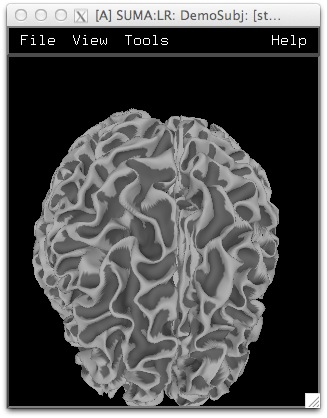
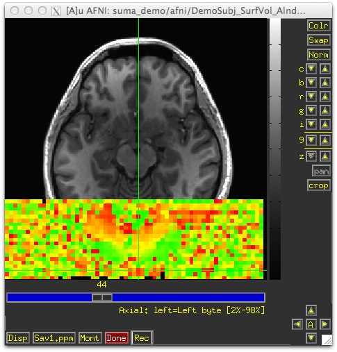
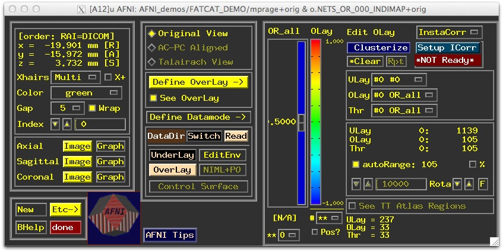

.. _viewer:

***************
**SUMA Viewer**
***************

.. _Surface_Viewing:

Surface Viewing
===============
This is a walk through the basics of surface navigation. To follow along you will need the :ref:`suma_demo` directory installed. 

To begin we go into the demo directory and launch *suma* and *afni* with the following commands::

   cd suma_demo/afni
   afni -niml &
   tcsh run_suma &
   
.. note::
   
   The script *run_suma* does little more than launch *suma* with the command::

      suma  -spec ../SurfData/SUMA/std.DemoSubj_both.spec        \
            -sv DemoSubj_SurfVol_Alnd_Exp+orig 

You should have *AFNI* up by now, and *SUMA* soon after. 

   
   :ref:`SUMA viewer showing smoothed white matter surfaces<media/surfview.0000.jpg>`
   

   
   :ref:`AFNI slice view<media/surfview.0001.jpg>`
   
.. figure:: media/surfview.0002.jpg
   :align: center
   :figwidth: 30%
   :target: ../_images/surfview.0002.jpg
   :name: media/surfview.0002.jpg
   
   :ref:`AFNI Controller<media/surfview.0002.jpg>`
   
.. container:: clearer
   
    .. image:: media/blank.jpg
   
   
   
Quick Tour
----------

   1. Talking to AFNI
   
      * Press :ref:`t <LC_t>` in the suma window to talk to *AFNI*
         
         * This sends anatomically correct surfaces to AFNI
      
      * You should be seeing surface contours atop the slices
      
         * Contours are the intersection of the surface with the slice
         
            * You could also see boxes representing the nodes that are within +/-1/2 slice from the center of the slice in view.

            * Colors and node box visibility can be changed to suit your desires from the :guilabel:`Control Surface` button in *AFNI*.

            .. figure:: media/surfview.0003.jpg
               :align: right
               :figwidth: 40%
               :target: ../_images/surfview.0003.jpg
               :name: media/surfview.0003.jpg
               
               :ref:`AFNI slice view with anatomically correct surfaces' contours<media/surfview.0003.jpg>`
               
      * Navigate through the volume in *AFNI*
      
         * Make sure you have an excellent alignment between volume and surface
         
         * Make sure surface adequaetly represents areas of the brain that are difficult to segment
         
            * occipital cortex
            
            * inferior frontal and inferior temporal regions
            
         * Surface may look good in *SUMA*, but may not match anatomy in some places -- this is why you check surfaces in the AFNI display.
         
         .. note:
         
         * The :term:`Surface Volume` and the surfaces must be in nearly perfect alignment.
         
            * If you have an improper alignment, it should be addressed here and now.
               * This should not happen for FreeSurfer and SureFit/Caret surfaces created in the standard fashion with :ref:`@SUMA_Make_Spec_FS` or :ref:`@SUMA_Make_Spec_Caret`, say. Problems might come up when you attempt to align data across days with :ref:`@SUMA_AlignToExperiment`. See also :ref:`Align_Surf_Vol<Align_Surf_Vol>`
               
            * Watch for error messages and warnings to come up in the shell as all the surfaces are read in. These messages should be examined once per subject since they do not change unless the surface's geometry or topology is changed.
            
            * Viewed without the volume underal, it is extremely difficult to tell if surface models with no topological defects accurately represent the cortical surface.
            
            
   2. Rotating the surface
   
      * :ref:`Button 1 drag<Button_1-Motion>`: keep it down while moving the mouse left to right. This rotates the surface about the screen's Y-axis (dotted green if :ref:`screen axes<F2>` are displayed). Let go of button-1 (usually the left button).
      
      * Repeat with up and down motion for rotation about X-axis and motion in various directions for rotations mimicking those of a trackball interface.
      
      * Also try :ref:`up/down <U-D_arrows>`, :ref:`left/right <L-R_arrows>` arrow keys.
         * Arrow keys rotate by increments specified by the unix environment variable :ref:`SUMA_ArrowRotAngle<SUMA_ArrowRotAngle>` in degrees.
         
         * You can set SUMA environment variables in file ~/.sumarc. See also option :ref:`-update_env<suma--update_env>` in *suma*.
   
.. _Prying:

   3. Prying & Z rotating the hemispheres
   
      * :ref:`Ctrl+button-1, drag<Ctrl+Button_1-Motion>`: Moving the mouse horizontally while button 1 is pressed and ctrl is down will pry hemispheres apart for better visualization. The prying behavior is different for spherical and flattened surfaces. Better try it than read about it. See also :ref:`F10 <F10>`
      
      .. figure:: media/surfview_pry3.jpg
         :align: center
         :name: media/surfview_pry3.jpg
         :target: ../_images/surfview_pry3.jpg
         
         :ref:`Prying anatomically correct surfaces<media/surfview_pry3.jpg>`
         
      .. figure:: media/surfview_pry3b.jpg
         :align: center
         :name: media/surfview_pry3b.jpg
         :target: ../_images/surfview_pry3b.jpg
         
         :ref:`Prying flat surfces<media/surfview_pry3b.jpg>`
         
      .. container:: clearer
   
         .. image:: media/blank.jpg
   
         
         * :ref:`Ctrl+button-1 double click <Ctrl+Button_1-DoubleClick>`: Undo prying.
      
      * :ref:`Shift+button-1 drag<Shift+Button_1-Motion>`: Rotate surfaces about screen's Z-axis. This option is useful for positioning flat surfaces when displayed one at a time. In most other circumstances, it leads to confusion.
      
         * :ref:`Shift+button 1 double click<Shift+Button_1-DoubleClick>`: Undo Z rotation
         
      * Translating surfaces
      
         * :ref:`Button-2 drag <Button_2-Motion>`:  keep it down while moving the mouse to translate surface along screen X and Y axes or any combinations of the two.
         
         * Also try :ref:`Shift+arrow <Shift+L-R_arrows>` keys.
         
      * Zooming in/out
      
         * Both :ref:`Buttons 1&2 or Shift+button2 <Shift+Button2-Motion>`: while pressing buttons, move mouse down or up to zoom in and out, respectively.
         
         * Also try keyboard buttons :ref:`Z<UC_Z>` and :ref:`z<LC_z>` for zooming in and out, respectively.

.. _Picking_Node:
.. _Picking_Faceset:
         
      * Picking a Node or a Facet:
      
         * :ref:`Button 3 <Button_3-Press>`: press over a location on a surface to pick the closest facet and node to the location of the pointer.

             *   The closest node is highlighted with a blue sphere
             
             *   The closest facet is highlighted with a gray triangle
         
            .. figure:: media/surfview.0010.jpg
               :align: right
               :figwidth: 20%
               :target: ../_images/surfview.0010.jpg
               :name: media/surfview.0010.jpg
               
               :ref:`The little crosshair that could<media/surfview.0010.jpg>`
               
         * Note the information written to the shell regarding the properties of the picked Node and Facet.
         
         * When connected to *AFNI* (after having pressed :ref:`t <LC_t>`), watch the AFNI crosshair jump to the corresponding location in the volume.
         
         * Conversely, position the crosshair in AFNI (a left click there) at a position close to the surface and watch the crosshari relocate in SUMA.
         
         * You can swap buttons 1 & 3's functions using the environment variable :ref:`SUMA_SwapButtons_1_3<SUMA_SwapButtons_1_3>`
      
      * Cardinal views (along coordinate directions)
      
         * :ref:`Ctrl+Left/Right <Ctrl+L-R_arrows>`: Views along LR axis
         
         * :ref:`Ctrl+Up/Down <Ctrl+U-D_arrows>`: Views along SI axis
         
         * :ref:`Ctrl+shift+Up/Down <Ctrl+Shift+U-D_arrows>`: Views along AP axis
         
         .. figure:: media/surfview_card.jpg
            :align: right
            :figwidth: 20%
            :target: ../_images/surfview_card.jpg
            :name: media/surfview_card.jpg
            
            :ref:`The cardinals<media/surfview_card.jpg>`
              
      * Resetting the view point
      
         * Press :ref:`Home(fn+left arrow macs)<HOME>`  to get back to the original vantage point.
         
         * :ref:`view->save <Save_View>` and :ref:`view->load <Load_View>` to save load views
         
      * Momentum feature
      
         * Press :ref:`m<LC_m>` to toggle momentum on. Click the left mouse button and release it as you are dragging the mouse. It should feel like you're throwing the surface.
         
      * Lots more
      
         * Function keys modify various aspects of the display
         
            * Those may be usurped by OS X, see Keyboard Setup or try key modifiers to get them to work.
            
         * See *SUMA*\ 's :ref:`help<LC_Ctrl+h>` or :ref:`Keyboard Controls <KeyboardControls>` for all interactive options.
         

.. _Recording_Images:

   4. Recording your images
  
      * Press :ref:`r<LC_r>` in the viewer to record the current scene. The image is captured in an AFNI flavored window. Successive record commands get saved in the same viewer.
        
         .. note::
         
            The record viewer acquires a GUI interface the moment it has more than one image in it. The interface is the same as that in AFNI. If you want to save a single captured image to disk, use 'Alt+Right Click' in the recorder window to pop a save menu which allows you to enter prefix of the image and more.

            When more than one image are captured in the recorder, you have numerous options to control the recording process. Consider turning off :menuselection:`Disp->Save One` to record multiple images in one pass. This changes the save button from :menuselection:`Sav1.jpg` to :menuselection:`Save.jpg`. If you've read this far, you should stop reading and try it for yourself.

            .. figure:: media/surfview.0015.jpg
               :align: right
               :figwidth: 20%
               :target: ../_images/surfview.0015.jpg
               :name: media/surfview.0015.jpg
               
               :ref:`This was a post-bac<media/surfview.0015.jpg>`
               
      * Press :ref:`r<LC_r>` on the **colorbar** of the :ref:`surface controller<SurfCont>` records an image of the colorbar.
      
      * Press :ref:`R<UC_r>` to record continuously from the viewer. Doing so puts the viewer in :term:`Recording Mode` where any operation that causes a change in the rendered image is directly captured in the recorder.
      
         * Identical consecutive images are rejected
         
         * Images caused by window expose events are ignored
         
         * If you let the recorder run continuously with very large images, you might quickly run out of memory on your computer.
         
      * Use :ref:`Ctrl+r<LC_Ctrl+r>` to capture the image directly to *disk* intead of to the recorder.
      
      * Similarly, :ref:`Ctrl+R<UC_Ctrl+R>` records continuously to *disk*
           
      * You can save/load viewer setting used to create a figure with :ref:`File->Save View<Save_View>` / :ref:`File->Load View<Load_View>`
      
         
   * Viewing a group of surfaces
      
      * Use :ref:`. (period)<LC_.>` to switch to the next viewing :term:`state` (pial then inflated, ...)
      
      * Use :ref:`, (comma)<LC_,>` to switch to the previous vieweing state
      
      * Navigate on any of the surfaces and watch AFNI's crosshair track the surface
      
      * Use :ref:`SPACE<SPACE>` to toggle between the current state and the state of the :ref:`Local Domain Parent<Spec_LocalDomainParent>`
      
   * Viewing multiple surfaces concurrently
      
      * :ref:`Ctrl+n<LC_Ctrl+n>` opens a new SUMA controller (up to 10 allowed, more possible, but ridiculous). 
      
      * Swith states in any of the viewers
      
      * all viewers are still connected to AFNI (if any are)
      
   * See the :ref:`SUMA controller <SumaCont>` for controlling the link between viewers.
   
   * Viewing datasets
   
      * Open the :ref:`surface controller<SurfCont>` (:ref:`Ctrl+s<LC_Ctrl+s>` if you forgot), and press :ref:`Load Dset<SurfCont->Dset_Controls->Load_Dset>`. 
      
      
      .. figure:: media/SurfCont.auto.QT.ALL.jpg
         :align: center
         :figwidth: 30%
         :target: ../_images/SurfCont.auto.QT.ALL.jpg
         :name: media/SurfCont.auto.QT.ALL.jpg
         
         :ref:`The controller of surfaces<media/SurfCont.auto.QT.ALL.jpg>`
         
      * From the available options, select one of **v2s.lh.TS.niml.dset**, or **v2s.rh.TS.niml.dset**.
         
         * One of the two should be available to you depending on which hemisphere is currently in focus. Contralateral dataset, if sanely named, gets automatically loaded onto the contralateral hemisphere.
         
         * To graph the time series, at the cross hair press :ref:`g<LC_g>` in SUMA.The graph window is wedded to the hemisphere in focus. You will need to press :ref:`g<LC_g>` on the contralateral hemisphere to get a graph for that hemisphere too.
         
         * Select other nodes or :ref:`Righ-Click+Drag<Button_3-Motion>` 
         
         * Press :menuselection:`Freeze` on graph window to preserve current graph
               * Clicking on other nodes will start a new graph
               
               .. figure:: media/ts.jpg
                  :align: center
                  :figwidth: 30%
                  :target: ../_images/ts.jpg
                  :name: media/ts.jpg
                  
                  For more help on graph window usage, including for instance how to save the time series, type **ctrl+h** with the graphing window in focus. :ref:`(link)<media/ts.jpg>`
               
         * Now let's look at a delay dataset (computed with :ref:`3ddelay<3ddelay>`). Press :ref:`Load Dset<SurfCont->Dset_Controls->Load_Dset>` and load one of **v2s.lh.DEL.niml.dset** or **v2s.rh.DEL.niml.dset**. SUMA will colorize the loaded dataset thereby creating a color plane for it, and will display it on the top of the pre-existing :term:`color planes`.
         
            * We begin by describing the right side block :ref:`Dset Mapping<SurfCont->Dset_Mapping>` which is used to colorize a dataset. Many of the options mimic those in AFNI's **Define Overlay** controls.
            
            * Many features are not mentioned here, use :ref:`BHelp <GL_CN_BHelp>` or :ref:`WHelp <GL_CN_WHelp>` interactively or the online help for the controller you are using, here the :ref:`surface controller <SurfCont>`.
            
            * From the :ref:`Dset Mapping <SurfCont->Dset_Mapping>` block on the right side of the interface
            
            .. figure :: media/SurfCont.auto.QT.DEL.Dset_Mapping.jpg 
               :align: right
               :figwidth: 30%
               :target: ../_images/SurfCont.auto.QT.DEL.Dset_Mapping.jpg  
               :name: media/SurfCont.auto.QT.DEL.Dset_Mapping.jpg
               
               :ref:`Dset colormapping GUI. <media/SurfCont.auto.QT.DEL.Dset_Mapping.jpg>` Should it look different, consider the more updated documentation :ref:`here<SurfCont>`
                  
            .. container:: clearer

                .. image:: media/blank.jpg
               
                ..
                
                   
                  * Select column **Corr. Coef.** for the :ref:`Threshold<SurfCont->Dset_Mapping->T>`
                     
                     * Press :ref:`v button <SurfCont->Dset_Mapping->T->v>` to apply thresholding.
                        
                     * Use the :ref:`scale<SurfCont->Dset_Mapping->Cmap->scale>` to set the threshold. Nodes whose cross correlation value does not pass the threshold will not get colored.
                        
                     * Note *p* (uncorrected), and *q* values (FDR) below the slider. ** FDR values are per-hemisphere **
                        
               .. note::
                  
                  * For simplicity, we mapped a statistical dataset onto the surface (see script  **run_3dVol2Surf** under :ref:`suma_demo/afni<suma_demo>`). This resulted in statistical parameters being averaged with being normalized.
                  
                  * A better approach would be to map the time series, and then perform the statistical computation. See script **run_3dVol2Surf** for examples.
               
               * Mapping Parameters Table (below the I, T, B selectors):
                  
                  * Used for setting the clipping ranges.

                  * Clipping is only done for color mapping. Actual data values do not change.
                  
                  * See detailed help :ref:`here<SurfCont->Dset_Mapping->SetRangeTable.c00>`. Note that a Left click on the :ref:`'I'<SurfCont->Dset_Mapping->SetRangeTable.r01>` locks ranges from automatic resetting when you choose a different dataset column for **I**. A right click on :ref:`'I'<SurfCont->Dset_Mapping->SetRangeTable.r01>` resets values to full range in data.
               
               * For color mapping controls see :ref:`Col<SurfCont->Dset_Mapping->Col>`,  :ref:`New<SurfCont->Dset_Mapping->Cmp->New>`, :ref:`Cmp<SurfCont->Dset_Mapping->Cmp>`, etc.
               
               * Bored? Try :ref:`Bias<SurfCont->Dset_Mapping->Bias>` for a change.
               
            * The colormap is rendered as a surface, and shares some of the functions of SUMA's viewer. You have keyboard controls when the mouse is over the colorbar. More info :ref:`here<Colormap_Keyboard_Controls>` and :ref:`there<SurfCont->Dset_Mapping->Cmap->bar>`.
            
            * Interactive clustering:
               
               * Left click on :ref:`Clst<SurfCont->Dset_Mapping->Clst.c00>` to activate/deactivate clustering. Cluster table is output to the shell. Clicking on a node shows its cluster label in the viewer.
               
            * For more information, resort to the help for the :ref:`Surface Controller<SurfCont>` and :ref:`Plane Layering<Plane_Layering>`.
            
      .. note:: Most of what was done for surface-based dataset applies to volumetric and connectivity data. 

.. _Volume_Viewing:

Volume Viewing
==============

We present a brief example of viewing volumes in SUMA.  This
particular case is one of looking at: probabilistic tractography
results (which are volumes), along with the target network that we
input (also volumes).  We'll load in the FA map from the DTI fits and
view it as slices for locating us in space. Finally, we can load in
the dset of structural connectivity for further information (labels,
graph connection and connectivity matrix viewing), but in this example
we won't use it much, actually. Commands of note will be highlighted
with dashed ellipsoids (ell) for ease of finding.

#. To load in the appropriate data sets into suma, we use the
   following commandline call from within the ``FATCAT_DEMO/DTI/``
   directory (assuming that you have run the scripts therein, you can
   follow along at home).  We are loading in most data as volumes (to
   be viewed as either surfaces or slices), with the ``*.dset`` file
   accompanying::

     suma                                       \
         -vol o.NETS_AND_000_PAIRMAP+orig[0]    \
         -vol DT_FA+orig                        \
         -vol ../ROI_ICMAP_GMI+orig[0]          \
         -gdset o.NETS_AND_000.niml.dset

   The following image is what we get (you may have different defaults
   for some minor characteristics on your own machine, but this is
   basically what should appear):

   .. figure:: media/FAT_VIEWING_ROIS/Screen_Shot_2015-02-01_at_9.15.34_AM.png
      :align: center
      :width: 60%
      :target: ../_images/Screen_Shot_2015-02-01_at_9.15.34_AM.png
      :name: media/FAT_VIEWING_ROIS/Screen_Shot_2015-02-01_at_9.15.34_AM.png
      
      :ref:`(link)<media/FAT_VIEWING_ROIS/Screen_Shot_2015-02-01_at_9.15.34_AM.png>`
      
      
   Volumes by default are viewed as slices, and in grayscale, so we
   mostly see the FA map and not the PAIRMAP of tract results nor the
   target ROI map. That default can be changed via environment variable :ref:`SUMA_VO_InitSlices<SUMA_VO_InitSlices>` in your :term:`.sumarc` file. If you have a volume rendered in 3D at this stage, turn that off with the :ref:`v<VolCont->VR->Ns->v>` button. The dset is represented as a graph, showing the
   centers-of-mass of the target ROIs with yellow spheres, and the
   locations of tractographic bundles on lines, colored by a matrix
   property in the dset.

#. To really get going, let's open up the controller, using either
   "View -> Object Controller" or just the shortcut "CTRL + s" while
   the SUMA viewer is foremost on the screen.  Now we have the viewer
   and the controller:

   .. figure:: media/FAT_VIEWING_ROIS/Screen_Shot_2015-02-01_at_9.15.44_AM_B.png
      :align: center
      :width: 75%
      :target: ../_images/Screen_Shot_2015-02-01_at_9.15.44_AM_B.png
      :name: media/FAT_VIEWING_ROIS/Screen_Shot_2015-02-01_at_9.15.44_AM_B.png
      
      :ref:`(link)<media/FAT_VIEWING_ROIS/Screen_Shot_2015-02-01_at_9.15.44_AM_B.png>`
      
   Each data object (here, volume or dset) will have its own control
   panel, which we can toggle through using the small up/down triangle
   "Switch" at the top of the panel (magenta ell.).  But first, we
   need to tell SUMA to prepare each panel, which we can most easily
   do by hitting the "All Objs." button (orange ell.).  After this,
   you can try toggling through each control panel, if you wish. (NB:
   this useful button appeared in Jan, 2015, so if you don't see,
   please update your AFNI/SUMA distribution!)

#. Toggle to the PAIRMAP file using the switches at the top, seeing
   the correct file name, in this case
   ``o.NETS_AND_000_PAIRMAP+orig[0]`` (magenta ell):

   .. figure:: media/FAT_VIEWING_ROIS/Screen_Shot_2015-02-01_at_9.16.05_AM_B.png
      :align: center
      :width: 75%
      :name: media/FAT_VIEWING_ROIS/Screen_Shot_2015-02-01_at_9.16.05_AM_B.png
      :target: ../_images/Screen_Shot_2015-02-01_at_9.16.05_AM_B.png
      
      :ref:`(link)<media/FAT_VIEWING_ROIS/Screen_Shot_2015-02-01_at_9.16.05_AM_B.png>`
      
   This zeroth brick contains a mask of all the WM ROIs found between
   any pair of targets in the image. Right now, it's being shown as
   slices, so it's hard to appreciate. Let's view these results as the
   surface of the volume.  

   Firstly, turn *off* the slice viewing, by unchecking the slice
   viewers, if they currently are highlighted (green ell.).  Then,
   turn *on* the surface viewing for the volume, by highlighting the
   :ref:`'v'<VolCont->VR->Ns->v>` in the "Volume Rendering Controls" (blue ell). Additionally, in
   this same part of the panel, you can adjust the density of surface
   rendering points, by changing the number in the 'Ns' box; this parameter is now set to the maximum number of slices in the volume. Increasing the number beyond this value does not help much, decreasing the number speeds up the rendering at the cost of more artifacts.

#. What you should see now is a big, gray mass of tract volume, as in
   the SUMA Viewer window here:

   .. figure:: media/FAT_VIEWING_ROIS/Screen_Shot_2015-02-01_at_9.16.25_AM_B.png
      :align: center
      :width: 75%
      :name: media/FAT_VIEWING_ROIS/Screen_Shot_2015-02-01_at_9.16.25_AM_B.png
      :target: ../_images/Screen_Shot_2015-02-01_at_9.16.25_AM_B.png
      
      :ref:`(link)<media/FAT_VIEWING_ROIS/Screen_Shot_2015-02-01_at_9.16.25_AM_B.png>`
      
   To change the colorscheme of the PAIRMAP (though, it is just a
   binary mask in this case), we can go to the 'Cmp' button in the
   Controller panel (magenta ell). 

#. Right-click on the 'Cmp' button, which opens up a list of colormaps:

   .. figure:: media/FAT_VIEWING_ROIS/Screen_Shot_2015-02-01_at_9.16.42_AM.png
      :align: center
      :width: 75%
      :target: ../_images/Screen_Shot_2015-02-01_at_9.16.42_AM.png
      :name: media/FAT_VIEWING_ROIS/Screen_Shot_2015-02-01_at_9.16.42_AM.png
      
      :ref:`(link)<media/FAT_VIEWING_ROIS/Screen_Shot_2015-02-01_at_9.16.42_AM.png>`
      
   and you can scroll through the list until you find something nice
   and visually pleasing, for example:

   .. figure:: media/FAT_VIEWING_ROIS/Screen_Shot_2015-02-01_at_9.17.16_AM.png
      :align: center
      :width: 75%
      :name: media/FAT_VIEWING_ROIS/Screen_Shot_2015-02-01_at_9.17.16_AM.png
      :target: ../_images/Screen_Shot_2015-02-01_at_9.17.16_AM.png
      
      :ref:`(link)<media/FAT_VIEWING_ROIS/Screen_Shot_2015-02-01_at_9.17.16_AM.png>`
      
   Ok, so that completes viewing that volume.
    
#. Now, let's say we want to *turn off* the viewing of the dset data.
   First, use the top arrows by the 'Switch' to go to the appropriate
   Control panel, until you see something that says
   "GMATRIX_DOlink..." at the top (magenta ell).  NB for dsets: the
   label here is not the filename in this case, but I think that what
   is shown is a string inside the file-- seeing 'MATRIX' should help
   identify it:

   .. figure:: media/FAT_VIEWING_ROIS/Screen_Shot_2015-02-01_at_9.17.41_AM_B.png
      :align: center
      :width: 75%
      :name: media/FAT_VIEWING_ROIS/Screen_Shot_2015-02-01_at_9.17.41_AM_B.png
      :target: ../_images/Screen_Shot_2015-02-01_at_9.17.41_AM_B.png
      
      :ref:`(link)<media/FAT_VIEWING_ROIS/Screen_Shot_2015-02-01_at_9.17.41_AM_B.png>`
      
   To not see any graph stuff, we'll just raise the threshold for the
   colorbar from '0' (green ell) all the way to the top.  Doing so
   (blue ell in next figure), results in a farwell to labels and edges:

   .. figure:: media/FAT_VIEWING_ROIS/Screen_Shot_2015-02-01_at_9.17.56_AM_B.png
      :align: center
      :width: 75%
      :name: media/FAT_VIEWING_ROIS/Screen_Shot_2015-02-01_at_9.17.56_AM_B.png
      :target: ../_images/Screen_Shot_2015-02-01_at_9.17.56_AM_B.png
      
      :ref:`(link)<media/FAT_VIEWING_ROIS/Screen_Shot_2015-02-01_at_9.17.56_AM_B.png>`
      
   If you have no use for the dset at this time, you also didn't have
   to load it into the SUMA viewer, either.

#. Ok, quickly now, let's practice again by viewing the target ROI
   network as surfaces.  So, toggle to the panel with that volume's
   filename (here, "../ROI_ICMAP_GMI+orig"), and turn *off* the Slice
   viewing and turn *on* the volume viewing, as done above, resulting
   in a panel and viewer that look like the following (I've just
   highlighted the locations from above where we had adjusted viewing
   controls):

   .. figure:: media/FAT_VIEWING_ROIS/Screen_Shot_2015-02-01_at_9.18.28_AM_B.png
      :align: center
      :width: 75%
      :target: ../_images/Screen_Shot_2015-02-01_at_9.18.28_AM_B.png
      :name: media/FAT_VIEWING_ROIS/Screen_Shot_2015-02-01_at_9.18.28_AM_B.png
      
      :ref:`(link)<media/FAT_VIEWING_ROIS/Screen_Shot_2015-02-01_at_9.18.28_AM_B.png>`
      
   |

#. Again, we can make the volumes have a non-grayscale colormap for
   viewing.  In this case, each target ROI has a separate integer, so
   a nice colorscheme could be the "ROI_i*" ones, or here I'll pick
   "Spectrum:red_to_blue+gap" from the 'Cmp' list (green ell in the
   following) for no particular reason:

   .. figure:: media/FAT_VIEWING_ROIS/Screen_Shot_2015-02-01_at_9.19.25_AM_B.png
      :align: center
      :width: 75%
      :target: ../_images/Screen_Shot_2015-02-01_at_9.19.25_AM_B.png
      :name: media/FAT_VIEWING_ROIS/Screen_Shot_2015-02-01_at_9.19.25_AM_B.png 
      
      :ref:`(link)<media/FAT_VIEWING_ROIS/Screen_Shot_2015-02-01_at_9.19.25_AM_B.png>`
      
   |

#. And that's pretty much that!  You can view the results from
   different angles, and note that you can select voxels rendered in 3D much like you can select voxels on slices, tracts, etc.: 

   +----------------------------------------------------------------------------------+----------------------------------------------------------------------------------+
   |.. figure:: media/FAT_VIEWING_ROIS/Screen_Shot_2015-02-01_at_9.20.40_AM.png       |.. figure:: media/FAT_VIEWING_ROIS/Screen_Shot_2015-02-01_at_9.22.18_AM.png       |
   |   :width: 100%                                                                   |   :width: 100%                                                                   |
   |   :name:  media/FAT_VIEWING_ROIS/Screen_Shot_2015-02-01_at_9.20.40_AM.png        |   :name:  media/FAT_VIEWING_ROIS/Screen_Shot_2015-02-01_at_9.22.18_AM.png        |
   |                                                                                  |                                                                                  |   
   |   :ref:`(link)<media/FAT_VIEWING_ROIS/Screen_Shot_2015-02-01_at_9.20.40_AM.png>` |   :ref:`(link)<media/FAT_VIEWING_ROIS/Screen_Shot_2015-02-01_at_9.22.18_AM.png>` |
   +----------------------------------------------------------------------------------+----------------------------------------------------------------------------------+

   |

.. _Tract_Viewing:

Tract Viewing
=============

This is a walk through the basics of tract navigation. To follow along you will need the :ref:`FATCAT_Demo` directory installed. 

   
Quick Tour
----------

   .. _QT_TR_1:
   
   1. A first look at the tracts
   
      To begin we go into the demo directory and launch *suma* and *afni* with the following commands::

         cd FATCAT_DEMO
         afni -niml -npb 12 -yesplugouts -layout demo_layout \
                     mprage+orig.HEAD DTI/*.HEAD ROI_ICMAP_GMI+orig.HEAD &
         suma -dev -npb 12 -niml -vol mprage+orig. \
                     -tract DTI/o.WB_000.niml.tract  &

      .. note::

         The script *Do_06_VISdti_SUMA_visual_ex1.tcsh* contains the same commands used above. You might want to chek out the help for option :ref:`-npb<suma--npb>`.

      You should have *AFNI* up by now, and *SUMA* soon after. 

      .. figure:: media/QT_TractCont.0000.jpg
         :align: left
         :figwidth: 30%
         :target: ../_images/QT_TractCont.0000.jpg
         :name: media/QT_TractCont.0000.jpg

         :ref:`(link)<media/QT_TractCont.0000.jpg>`
         
      .. figure:: media/QT_TractCont.0001.jpg
         :align: right
         :figwidth: 30%
         :target: ../_images/QT_TractCont.0001.jpg
         :name: media/QT_TractCont.0001.jpg
         
         :ref:`(link)<media/QT_TractCont.0001.jpg>`
         
      .. figure:: media/QT_TractCont.0002.jpg
         :align: center
         :figwidth: 30%
         :name: media/QT_TractCont.0002.jpg
         :target: ../_images/QT_TractCont.0002.jpg
         
         :ref:`(link)<media/QT_TractCont.0002.jpg>`
         
      .. container:: clearer

          .. image:: media/blank.jpg

   
      Right-click on the tracts to select a location along them. The crosshair should mark the location along the tract where you clicked. The selection would make AFNI jump to the same mm location if the two programs are talking. To make them talk, press :ref:`t <LC_t>` in the suma windowto get them talking and try the selections again.
      
      Left- middle-mouse buttons operate as they do for surface viewing.
      
      Open the :ref:`tract controller<TractCont>` via :menuselection:`View--> Object Controllers` or :ref:`Ctrl+s<LC_Ctrl+s>`. Select locations anew and examine controller update coordinates and selection information.
      

   2. InstaTract, or interactive mask selection
   
      Create a mask by clicking on :ref:`Masks<TractCont->Coloring_Controls->Masks>` in the tract controller. This creates a masking sphere and only tracts going through it are displayed. 
      
      .. figure:: media/QT_TractCont.0003.jpg
         :align: center
         :figwidth: 30%
         :target: ../_images/QT_TractCont.0003.jpg
         :name: media/QT_TractCont.0003.jpg
         
         :ref:`(link)<media/QT_TractCont.0003.jpg>`
         
      To move the sphere right-double click on it to place SUMA in :ref:`Mask Manipulation Mode<Mask_Manipulation_Mode>` which is indicated by displaying the ball as a mesh.
      
      .. figure:: media/QT_TractCont.0004.jpg
         :align: left
         :figwidth: 30%
         :target: ../_images/QT_TractCont.0004.jpg
         :name: media/QT_TractCont.0004.jpg
         
         :ref:`SUMA in mask manipulation mode<media/QT_TractCont.0004.jpg>`
         
      .. figure:: media/QT_TractCont.0007.jpg
         :align: right
         :figwidth: 30%
         :target: ../_images/QT_TractCont.0007.jpg
         :name: media/QT_TractCont.0007.jpg
         
         :ref:`Selection of voxel while in mask manipulation mode repositions mask at selected voxel.<media/QT_TractCont.0007.jpg>`
         
      .. container:: clearer

          .. image:: media/blank.jpg
   
      Selecting a location on the tracts will make the ball jump to that location. Clicking on the slices or surfaces whenever present, will position the mask at the selected voxel, or surface node. If you select while dragging, the selection is only made on the type of object on which you began the selection. For instance, if you select a location on the tracts and start dragging without releasing the right-mouse button, the ball will track along non-masked tracts that fall under your pointer, even if you go over surfaces or slices that are closer to your viewpoint. 
      
      Tracts that fall outside of the mask are hidden by default. You can also choose to display them in gray scale or in dimmed colors by manipulating the :ref:`hiding option <TractCont->Coloring_Controls->Hde>`.
      
      .. figure:: media/QT_TractCont.0015.jpg
         :align: left
         :figwidth: 45%
         :target: ../_images/QT_TractCont.0015.jpg
         :name: media/QT_TractCont.0015.jpg
         
         :ref:`Hidden tracts shown in gray.<media/QT_TractCont.0015.jpg>`
         
      .. figure:: media/QT_TractCont.0016.jpg
         :align: right
         :figwidth: 45%
         :target: ../_images/QT_TractCont.0016.jpg
         :name: media/QT_TractCont.0016.jpg
         
         :ref:`Hidden tracts shown in dimmed color<media/QT_TractCont.0016.jpg>`
         
      .. container:: clearer

          .. image:: media/blank.jpg
   
      The mask should also be visibile in AFNI. Clicking in AFNI will make the mask move in SUMA also.
      
      .. figure:: media/QT_TractCont.0005.jpg
         :align: center
         :figwidth: 30%
         :target: ../_images/QT_TractCont.0005.jpg
         :name: media/QT_TractCont.0005.jpg
         
         Crosshair movements in AFNI while SUMA is in mask manipulation mode will reposition the ball at the selected voxel's center :ref:`(link)<media/QT_TractCont.0005.jpg>`.
         
      You can manipulate the size of the mask with :ref:`Ctrl+Scroll (go slow!) <Ctrl+Scroll>` or with the masks controller interface mentioned below.

      .. figure:: media/QT_TractCont.0006.jpg
         :align: center
         :figwidth: 30%
         :target: ../_images/QT_TractCont.0006.jpg
         :name: media/QT_TractCont.0006.jpg
         
         :ref:`(link)<media/QT_TractCont.0006.jpg>`
         
      To turn off 'Mask Manipulation Mode', right-double click in open air, or on the ball itself.
      
      Another click on Masks will also open the :ref:`masks controller<MaskCont>`, which allows for :ref:`complex masking configurations<Tract_Tinting>`. Check out the mask controller's :ref:`link <MaskCont>` for information on how to manipluate the mask in detail.
      
   3. Looking at tracts within blobs making up one ROI.
   
      Here we are showing those tracts that go through any of the ROIs in the DMN per the results of deterministic tracking in 3dTrackID that were generated in script Do_05_RUNdti_DET_tracking.tcsh of :ref:`FATCAT_Demo<FATCAT_Demo>`. 
      
      This example is from the second part of demo script *Do_06_VISdti_SUMA_visual_ex1.tcsh*. Close the old AFNI & SUMA windows and launch new ones with the following commands::

         @Quiet_Talkers -npb_val 12
         afni -npb 12 -niml -yesplugouts -layout demo_layout \
                      mprage+orig.HEAD DTI/*.HEAD ROI_ICMAP_GMI+orig.HEAD &
         plugout_drive -npb 12  \
                      -com 'SET_FUNCTION o.NETS_OR_000_INDIMAP+orig 0 0' \
                      -com 'SET_THRESHOLD 0'  \
                      -com 'SET_ANATOMY mprage+orig' \
                      -com 'SET_DICOM_XYZ 18 7 -10'   \
                      -quit
         suma -npb 12  -niml -onestate                  \
                           -vol mprage+orig.                \
                           -i Net_000.gii                   \
                           -tract DTI/o.NETS_OR_000.niml.tract &
         DriveSuma -npb 12   -com surf_cont -surf_label Net_000.gii          \
                             -switch_cmap amber_monochrome -Dim 1.0          \
                             -com viewer_cont -key '.' -key 't'

   .. note::
   
      The suma command now includes a set of surfaces representing the ROIs. Those were created with program :ref:`IsoSurface<IsoSurface>` in script  Do_05_RUNdti_DET_tracking.tcsh of :ref:`FATCAT_Demo<FATCAT_Demo>`.

.. figure:: media/QT_TractCont.0008.jpg
   :align: left
   :figwidth: 30%
   :target: ../_images/QT_TractCont.0008.jpg
   :name: media/QT_TractCont.0008.jpg
   
   :ref:`(link)<media/QT_TractCont.0008.jpg>`
   
.. figure:: media/QT_TractCont.0009.jpg
   :align: right
   :figwidth: 30%
   :target: ../_images/QT_TractCont.0009.jpg
   :name: media/QT_TractCont.0009.jpg
   
   Colors indicate the number of tracts passing through a voxel :ref:`(link)<media/QT_TractCont.0009.jpg>`. Search for **INDIMAP** in the help for program :ref:`3dTrackID<3dTrackID>`. 
   

   
   :ref:`(link)<media/QT_TractCont.0013.jpg>`
   
.. container:: clearer
   
    .. image:: media/blank.jpg
   
   4. By default, points along the tracts are colored based on their local orientation. You can also color them based on the orientation of their midpoint with :menuselection:`Switch Dset --> o.NETS_OR_000_MID` accessible from the tract controller. You can also color by bundle with :menuselection:`Switch Dset --> o.NETS_OR_000_BUN`, however there is only one :term:`bundle` in this set of tracts because there is only one ROI involved - all the blobs are part of the same ROI in this example. 
   
   .. figure:: media/QT_TractCont.0011.jpg
      :align: left
      :figwidth: 30%
      :target: ../_images/QT_TractCont.0011.jpg
      :name: media/QT_TractCont.0011.jpg
      
      :ref:`Tract coloring by direction at mid tract<media/QT_TractCont.0011.jpg>`

   .. figure:: media/QT_TractCont.0012.jpg
      :align: right
      :figwidth: 30%
      :target: ../_images/QT_TractCont.0012.jpg
      :name: media/QT_TractCont.0012.jpg
      
      :ref:`Tract coloring by bundle. All tacts are part of the same bundle here.<media/QT_TractCont.0012.jpg>`

.. container:: clearer
   
    .. image:: media/blank.jpg
   
   5. If you're feeling adventurous, open the controllers :ref:`for the surface<SurfCont>` forming the ROIs by selecting a point on the surface (the controller is created automatically once the :ref:`controller notebook <Controller_Notebook>` is open), and on a point of the volume to create the :ref:`volume controller<VolCont>`. For the image blow, I hid the surface with :ref:`Drw <SurfCont->Surface_Properties->Drw>`, hid the :ref:`sagittal slice<VolCont->Sa_slc->Sa>` from the volume controller, set the :ref:`transparency <VolCont->Slice_Controls->Trn>` to 8, then turned on the 3D rendering with :ref:`v<VolCont->VR->Ns->v>`.  
   
   .. figure:: media/QT_TractCont.0014.jpg
      :align: center
      :figwidth: 50%
      :target: ../_images/QT_TractCont.0014.jpg
      :name: media/QT_TractCont.0014.jpg
      
      :ref:`(link)<media/QT_TractCont.0014.jpg>`

   6. Whole brain tractography results with surfaces.
   
      This example is based on script Do_09_VISdti_SUMA_visual_ex2.tcsh of :ref:`FATCAT_Demo<FATCAT_Demo>`. You can run it to launch the demo automatically, or do it the hard way with::
      
         @Quiet_Talkers -npb_val 12
         suma  -npb 12 -niml \
               -spec SUMA/std.60.FATCAT_both.spec \
               -sv mprage+orig \
               -vol mprage+orig. \
               -tract DTI/o.WB_000.niml.tract &
               
      The command uses the same data used in the Do_06 script, and in :ref:`paragraph 1 <QT_TR_1>` of the quick tour above,  except that we are also showing the cortical surfaces loaded via option :ref:`-spec<suma--spec>`.
      
      Open the object controllers for :ref:`volume<VolCont>`, :ref:`tracts<TractCont>`, and :ref:`surfaces<SurfCont>`. Select a tract and create a tract :ref:`mask<TractCont->Coloring_Controls->Masks>`. As mentioned earlier, the mask can be positioned on the surfaces, just as you would position it on the tracts or the slices. However the surfaces obstruct the view and tracts are not visible. You could make them transparent (press :ref:`o<LC_o>` twice in SUMA) but that may not be ideal. Another option is to pry the surfaces apart with ctrl+click and drag, left right, and/or up down. You can now position the mask on the pried surfaces and have the same masking effect. When the surfaces are pried apart, a doppleganger of the mask is shown on the displaced surfaces, and the mask ball is shown in the anatomically correct location.

      Walk along the corpus callosum, for instance, and watch tracts follow along. When talking to AFNI, correspondence between pried surfaces and locations in the volume is maintained throughout.

      .. figure:: media/QT_TractCont.0018.jpg
         :align: left
         :figwidth: 30%
         :target: ../_images/QT_TractCont.0018.jpg
         :name: media/QT_TractCont.0018.jpg
         
         You can position the mask on the surface but few of the tracts are visible this way. :ref:`(link)<media/QT_TractCont.0018.jpg>`

      .. figure:: media/QT_TractCont.0021.jpg
         :align: right
         :figwidth: 30%
         :target: ../_images/QT_TractCont.0021.jpg
         :name: media/QT_TractCont.0021.jpg
         
         Surface pried open and viewer opacity turned off with two more :ref:`o. <LC_o>` clicks :ref:`(link)<media/QT_TractCont.0021.jpg>`. You can continue to position the mask on the pried surfaces.

      .. figure:: media/QT_TractCont.0019.jpg
         :align: center
         :figwidth: 30%
         :target: ../_images/QT_TractCont.0019.jpg
         :name: media/QT_TractCont.0019.jpg
         
         Turning on 50% transparency for all objects by clicking :ref:`o<LC_o>` twice - not thrice - helps, but not that cool :ref:`(link)<media/QT_TractCont.0019.jpg>`. 

      .. container:: clearer

       .. image:: media/blank.jpg

   .. note::
   
      For more on prying, see :ref:`Prying Brains Apart<Prying_Brains_Apart>` and the :ref:`F10 key<F10>`.
      

   7. For more anatomical connectivity excitement, follow along with remaining demos in script **Do_09_VISdti_SUMA_visual_ex2.tcsh** and remaining Do_*VIS* scripts of :ref:`FATCAT_Demo<FATCAT_Demo>`.

      
.. _Graph_Viewing:

Graph Viewing
=============

This is a walk through the basics of graph (connectivity matrix) navigation. To follow along you will need the :ref:`FATCAT_Demo` directory installed.

      For starters, we need to go into the demo directory and launch *suma* and *afni* with the following commands::
         
         @Quiet_Talkers -npb_val 12
         cd FATCAT_DEMO
         afni -npb 12 -niml -yesplugouts -layout demo_layout \
                             *.HEAD DTI/*.HEAD &
         cd DTI/
         suma  -npb 12 -niml \
               -onestate \
               -i ../SUMA/std.60.lh.smoothwm.gii \
               -i ../SUMA/std.60.rh.smoothwm.gii \
               -i ../Net_000.gii     \
               -sv ../mprage+orig \
               -vol ../mprage+orig. \
               -gdset o.NETS_AND_MINIP_000.niml.dset &
         cd -
         DriveSuma -npb 12 \
            -com viewer_cont -key 't'  \
            -com surf_cont -view_surf_cont y
         
      .. note::

         The script *Do_09_VISdti_SUMA_visual_ex2.tcsh* contains the same commands used above. New options to ponder for your amusement here include :ref:`-onestate<suma--npb>`, and :ref:`-gdset<suma--gdset>`. Also, program :ref:`DriveSuma<DriveSuma>` is used to control suma by mimicking user input.For more driving good times, see also :ref:`@DO.examples<@DO.examples>`, :ref:`@DriveSuma<@DriveSuma>`, and :ref:`@DriveAfni<@DriveAfni>`.

Quick Tour
----------

   1. Looking at the connectivity matrices between DMN ROIs
   
   A connectivity matrix is considered a graph dataset in SUMA and can be rendered as a set of nodes connected by edges, or as a matrix. The dual forms can be rendered simultaneously this way:
   
      * Open a new SUMA controller with :ref:`Ctrl+n<LC_Ctrl+n>`
      
      * Switch :term:`states` till you get to the matrix (:ref:`. (period)<LC_.>`)
      
      * Select a connection, either by clicking on an edge or its corresponding cell in the matrix.

      .. figure:: media/QT_TractCont.0022.jpg
         :align: left
         :figwidth: 30%
         :target: ../_images/QT_TractCont.0022.jpg
         :name: QT_TractCont.0022.jpg
         
         Graph display, with slices in background at 50% transparency :ref:`(link)<QT_TractCont.0022.jpg>`.

      .. figure:: media/QT_TractCont.0024.jpg
         :align: right
         :figwidth: 30%
         :target: ../_images/QT_TractCont.0024.jpg
         :name: media/QT_TractCont.0024.jpg
         
         :ref:`Dual graph representation as a matrix<media/QT_TractCont.0024.jpg>`

      .. figure:: media/QT_TractCont.0023.jpg
         :align: center
         :figwidth: 30%
         :target: ../_images/QT_TractCont.0023.jpg
         :name: media/QT_TractCont.0023.jpg
         
         :ref:`Setting for tract controller.<media/QT_TractCont.0023.jpg>` 

      .. container:: clearer

       .. image:: media/blank.jpg

      
   The edges (cells) carry the connection values. Open the :ref:`graph controller<GraphCont>` with :ref:`Ctrl+n<LC_Ctrl+n>` to get information about a particular connection, and do all the kinds of colorization controls that are available for surface datasets and volumes.

   Selecting an edge highlights the cell in the matrix and vice versa.
   
   Selecting a node (label, or ball in 3D graph mode, label in matrix mode) will only show connections to that node.
   
      .. figure:: media/QT_TractCont.0026.jpg
         :align: left
         :figwidth: 30%
         :target: ../_images/QT_TractCont.0026.jpg
         :name: media/QT_TractCont.0026.jpg
         
         :ref:`Connections to node N000:R3 only in 3D graph rendering<media/QT_TractCont.0026.jpg>`

      .. figure:: media/QT_TractCont.0027.jpg
         :align: right
         :figwidth: 30%
         :target: ../_images/QT_TractCont.0027.jpg
         :name: media/QT_TractCont.0027.jpg
         
         :ref:`Connections to node N000:R3 in matrix rendering<media/QT_TractCont.0027.jpg>`

      .. container:: clearer

       .. image:: media/blank.jpg

   
   The set of controls on the lower left side is particular to graph datasets. Explore as curiosity moves you, the BHelp button comes in handy here but the help messages are still a work in progress. Complain away!

   **Of note** is the :ref:`Bundles<GraphCont->GDset_Controls->Bundles>` button, try it, it is cool.

      .. figure:: media/QT_TractCont.0025.jpg
         :align: center
         :figwidth: 45%
         :target: ../_images/QT_TractCont.0025.jpg
         :name: media/QT_TractCont.0025.jpg
         
         :ref:`Representing edges by corresponding bundles<media/QT_TractCont.0025.jpg>`

      .. container:: clearer

       .. image:: media/blank.jpg

   Note that as with all AFNI datasets, you can have multiple :term:`sub-bricks`, here matrices of course. You can navigate between them using the sub-brick selectors (:ref:`I<GraphCont->GDset_Mapping->I>`, :ref:`T<GraphCont->GDset_Mapping->T>`, :ref:`B<GraphCont->GDset_Mapping->B>`) on the right side of the controller.

   So far, no thresholding was applied, so go ahead and try it out.
   
.. _Displayable Objects:

Displayable Objects
===================

   .. todo::

      Show directions for example, show surface based normals, explain how you can hide some, etc. Link to other demos. For now, see the following for some inspiration: 
         1. Interactive loading of displayable objects: :ref:`Ctrl+Alt+s<LC_Ctrl+Alt+s>`
         
         2. Demo script illustrating variety of DOs: :ref:`@DO.examples<@DO.examples>`
         
      .. figure:: media/DO.examples.jpg
         :align: center
         :name: media/DO.examples.jpg
         :figwidth: 50%
         :target: ../_images/DO.examples.jpg

         :ref:`Output of script @DO.examples<media/DO.examples.jpg>` showing text, textures and geometric objects displayed simultaneously.
         
      ..
         
         2. This AFNI message board `posting <https://afni.nimh.nih.gov/afni/community/board/read.php?1,146351,146380#msg-146380>`_  explaining how to show principal orientations in a volume.
         
      .. figure:: media/directions.jpg
         :align: center
         :name: media/directions.jpg
         
         :ref:`Display of voxelwise diffusion directions<media/directions.jpg>`
      ..
      
          

.. _ECOG_Grid_Viewing:

ECOG Grid Viewing
=================

   .. todo::

      Show example of grid viewing. Until that is done, take a look at script :ref:`@ElectroGrid<@ElectroGrid>`

     
.. _ Mouse+Keyboard:

Mouse & Keyboard
================

   This section includes help for mouse (pointer) and keyboard driven interactions with SUMA.

.. include:: auto_inc/Mouse_Keyb_help.inc

.. include:: auto_inc/Mouse_Cmap_Keyb_help.inc

.. _ObjectControllers:

.. _ColorMixing:

Color Mixing
============

.. _Color_Plane_Grouping:

Color Plane Grouping
--------------------
Colorized Dsets are organized into layered color planes
   2 commonly used planes are:
      Surface Convexity (usually in gray scale) 
      AFNI Function (usually in color)
   Planes are assigned to two groups
      Background planes (like Convexity)
      Foreground planes (like AFNI Function)
      Many other planes can be added to either group.
Color planes of the same group are mixed together:
   Planes are stacked based on their order and opacity.
   Opacity of 1st plane in a group does not affect color mixing.
   There are 2 modes for mixing colors. See :ref:`F7 <F7>` key in SUMA.

.. _opacity_01:

.. figure:: media/opacity_01.jpg
   :align: center
   :name: media/opacity_01.jpg
   
   :ref:`(link)<media/opacity_01.jpg>`
   
.. _Plane_Layering:
   
Layering fore- & background planes
----------------------------------   
      To demonstrate the layering of foreground and background planes, start with a view of an inflated surface with come color overlay such as you would get from talking to AFNI. Requires :ref:`suma_demo <suma_demo>`
      
      .. figure:: media/collayer.0000.jpg
         :align: center
         :name: media/collayer.0000.jpg
         
         :ref:`(link)<media/collayer.0000.jpg>`
      ..
      
      Turn foreground plane(s) off by pressing :ref:`f <LC_f>` once   
         Now all you see is the background plane(s)   
      
      .. figure:: media/collayer.0001.jpg
         :align: center
         :name: media/collayer.0001.jpg
         
         :ref:`(link)`<media/collayer.0001.jpg>`
         
      Turn background planes off by pressing :ref:`b <LC_b>` once   
         Now all you see is "No Color" color on all nodes   
      
      .. figure:: media/collayer.0002.jpg
         :align: center
         :name: media/collayer.0002.jpg
         
         :ref:`(link)<media/collayer.0002.jpg>`
         
      Turn foreground plane(s) back on with :ref:`f <LC_f>`   
         Now you have foreground without background   
         
      .. figure:: media/collayer.0003.jpg
         :align: center
         :name: media/collayer.0003.jpg
         
         :ref:`(link)<media/collayer.0003.jpg>`
         
         
      Turn background plane(s) back on with :ref:`b <LC_b>`  
         Now you have foreground atop background   
         You can still see the background underneath the foreground -- this is due to the background brightness attenuation of the foreground colors.
            
      Toggle background intensity attenuation off and on with :ref:`a <LC_a>` and see the effect on the resultant maps.
      
      .. figure:: media/collayer.0004.jpg
         :align: left
         :name: media/collayer.0004.jpg
         
         :ref:`(link)<media/collayer.0004.jpg>`
         
        
      .. figure:: media/collayer.0000.jpg
         :align: center
         
         :ref:`(link)<media/collayer.0000.jpg>`
         

.. _Color_Plane_Opacity:

Playing with color plane opacity
--------------------------------
   Continuing with the demo surfaces and pre-existing color planes (datasets)...
   
   Open surface controller with :ref:`ctrl+s <LC_Ctrl+s>` or :menuselection:`View->Surface Controller`
      Turn OFF :ref:`1 <SurfCont->Dset_Controls->1>`
   Load in color plane :file:`lh.1D.col` using :ref:`Load Col <SurfCont->Dset_Controls->Load_Col>` or :ref:`c <LC_c>`
      This is an RGB Dset, so color mapping controls are hidden 
      Plane is placed atop of the foreground group
      Its opacity is 1 so it will obsucure the functional data
      
      .. figure:: media/colop.0000.jpg
         :align: center
         :name: media/colop.0000.jpg
         
         :ref:`(link)<media/colop.0000.jpg>`

      ..
      
      Background attenuation is not affected by plane's opacity
         try turning it on and off again with :ref:`a <LC_a>`
         
      .. figure:: media/colop.0001.jpg
         :align: center
         :name: media/colop.0001.jpg
         
         :ref:`(link)<media/colop.0001.jpg>`

      
      Now lower the opacity of :file:`lh.1D.col` with :ref:`Opa <SurfCont->Dset_Controls->Opa>` and watch the colors from the planes below start to show through
      
      .. figure:: media/colop.0003.jpg
         :align: left
         :name: media/colop.0003.jpg
         
         :ref:`(link)<media/colop.0003.jpg>`

      .. figure:: media/colop.0002.jpg
         :align: center
         :name: media/colop.0002.jpg
         
         :ref:`(link)<media/colop.0002.jpg>`

      |
      
      .. That | above is to put a line break after figure and avoid messing up the centering of the heading below.
      
Playing with color plane order
------------------------------
   Continuing with the examples above, with inflated view and function from AFNI displayed on the surfaces...
   
   We will push dataset from :file:`lh.1D.col` below the function from AFNI
      Use :ref:`Switch Dset <SurfCont->Dset_Controls->Switch_Dset>` to get a list of available planes
      Prefixes *fg:* and *bg:* denote plane's group membership
      Select *lh.1D.col* and lower its order with the :ref:`Ord <SurfCont->Dset_Controls->Ord>` button
      Select *FuncAfni_0* and play with its opacity
      Note: You can't make a plane change its group membership, yet.
      
   You can't delete a loaded color plane yet, but you can reload it if it changes on disk, or you can hide it with :ref:`Dsp <SurfCont->Dset_Controls->Dsp>`.
   
   Turn :ref:`1 <SurfCont->Dset_Controls->1>` ON if you just want to see the selected plane with no blending business from other planes.
      The plane displayed would be the one whose label is shown in the surface controller.
      
   Test!
      Find a way to flip between the mapping from AFNI and the mapping done with `3dVol2Surf <https://afni.nimh.nih.gov/pub/dist/doc/program_help/3dVol2Surf.html>`_ on the command line with script :file:`run_3dVol2Surf`.
         Appreciate the differences between the two mappings.
         

.. _Align_Surf_Vol:

Alignment of Surfaces with Volumes
==================================

.. todo::
   
   Explain alignment of surfaces with volumes.
   
   
.. _Spec_File:

The Spec File
=============

The Spec file contains information about surfaces that will be available to a program.
   
   * Information is specified in the format: **field = value**
   
   * The **=** sign must be preceded and followed by a space character.
   
   * **#** delimit comment lines, empty lines and tabs are ignored.
   
   * In addition to fields, there is also the :ref:`NewSurface <Spec_NewSurface>` tag which is used to announce a new surface.
   
   * Unrecognized text will cause the program parsing a Spec file to complain and exit.
   
   * See programs :ref:`quickspec<quickspec>` and :ref:`inspec<inspec>` for manipulations of spec files.
   
   * Here is a sample spec file::
   
      # delimits comments 
      # define the group
         Group = DemoSubj
      
      # define various States
         StateDef = smoothwm
         StateDef = pial
         StateDef = inflated
         
      NewSurface
         SurfaceFormat = ASCII
         SurfaceType = FreeSurfer
         FreeSurferSurface =
         lh.smoothwm.asc
         LocalDomainParent = SAME
         SurfaceState = smoothwm
         EmbedDimension = 3
      
      NewSurface
         SurfaceFormat = ASCII
         SurfaceType = FreeSurfer
         FreeSurferSurface = lh.pial.asc
         LocalDomainParent =
         lh.smoothwm.asc
         SurfaceState = pial
         EmbedDimension = 3
      
      NewSurface
         SurfaceFormat = ASCII
         SurfaceType = FreeSurfer
         FreeSurferSurface = lh.inflated.asc
         LocalDomainParent = lh.smoothwm.asc
         SurfaceState = inflated
         EmbedDimension = 3
      
      NewSurface
         SurfaceFormat = ASCII
         SurfaceType = FreeSurfer
         FreeSurferSurface = lh.sphere.asc
         LocalDomainParent = lh.smoothwm.asc
         SurfaceState = sphere
         EmbedDimension = 3
   
   * Fields of the Spec File:
   
      .. _Spec_Group:
      
      * *Group*\ : Usually the Subject's ID. In the current SUMA version, you can only have one group per spec file. All surfaces read by SUMA must belong to a group.
      
      .. _Spec_NewSurface:
      
      * *NewSurface*\ : A tag announing the beginning of a set of fields for a new surface.
       
      .. _Spec_FreeSurferSurface:
      .. _Spec_SurfaceName:
      
      *  *SurfaceName* or *FreeSurferSurface*\ : Name of the surface file.
      
      .. _Spec_SurfaceFormat:
      
      *  *SurfaceFormat*\ : ASCII or BINARY
      
      .. _Spec_SurfaceType:
      
      *  *SurfaceType*\ :  FreeSurfer, Caret, BrainVoyager, Ply, etc.
      
      .. _Spec_SurfaceState:
      
      *  *SurfaceState*\ : Surfaces can be in different states such as inflated, flattened, etc. The label of a state is arbitrary and can be defined by the user. The set of available states must be defined with :ref:`StateDef<Spec_StateDef>` at the beginning of the Spec file.
      
      .. _Spec_StateDef:
      
      *  *StateDef*\ : Used to define the various states. This must be placed before any of the surfaces are specified.
      
      .. _Spec_Anatomical:
      
      *  *Anatomical*\ : Used to indicate whether surface is anatomically correct (Y) or not (N). Anatomically correct surfaces are sent to AFNI.
      
      .. _Spec_LocalDomainParent:
      
      *  *LocalDomainParent*\ : Name of a surface whose mesh is shared by other surfaces in the spec file.
      
         *  The default for FreeSurfer surfaces is the smoothed gray matter/ white matter boundary. For SureFit it is the fiducial surface. Use SAME when the LocalDomainParent for a surface is the surface itself.
      
      .. *  A node-to-node correspondence is maintained across surfaces sharing the same domain parent.
      
      .. _Spec_EmbedDimension:
      
      * *EmbedDimension*\ : Embedding Dimension of the surface, 2 for surfaces in the flattened state, 3 for other.
      
      
