.. _cover:

*********
**Intro**
*********

.. _surface-based:

SUMA is a program that adds cortical surface based functional imaging analysis to the AFNI suite of programs https://afni.nimh.nih.gov . SUMA allows 3D cortical surface renderings, the mapping of volumetric data onto them and, surface based computations and statistical inferences. In addition allows rendering and manipulation of tractography results, connectivity graphs/matrices, and volumes. 

.. _cover-figure:

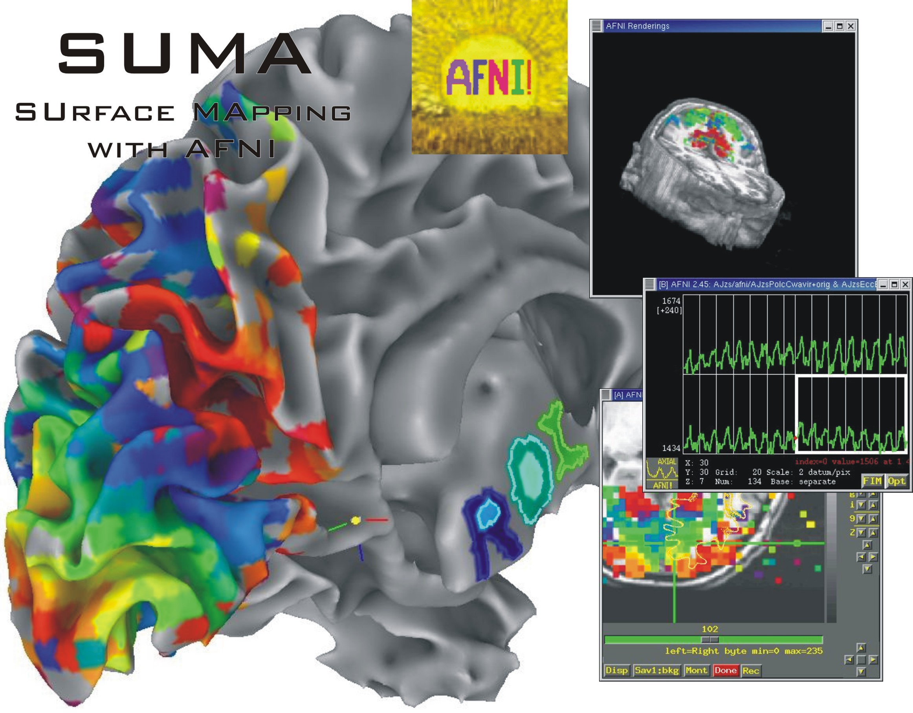
   
   :ref:`Days of yore<cover-figure>`
   
.. _connectivity-data:

SUMA also allows display and manipulation of matrices for various flavors of connectivity data, tractography results from AFNI's FATCAT toolbox, and the rendering of volumetric data.

.. _HBM14_01:
  
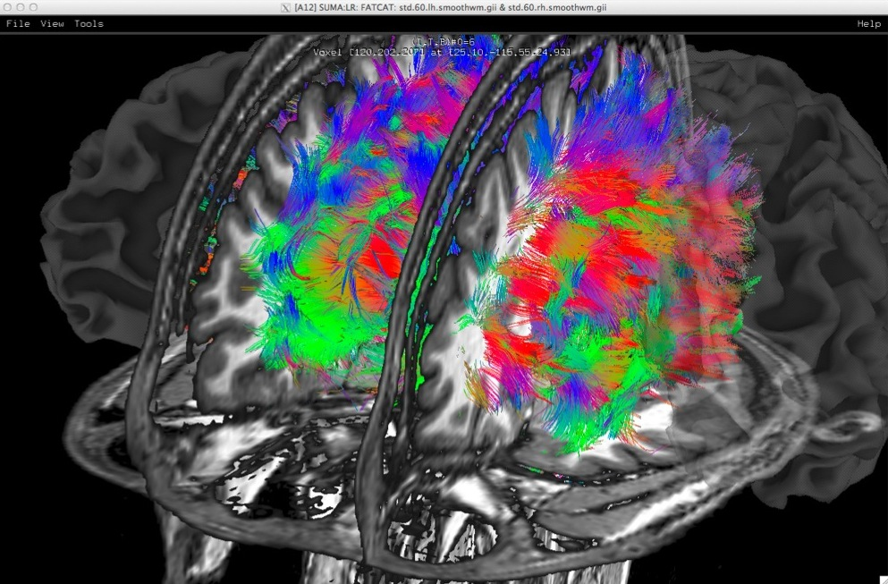
   
   :ref:`FACTCAT Days<HBM14_01>`
   
   Whole brain deterministic tractography with AFNI-FATCAT as rendered with SUMA. Surface models, here shown with transparency, are pried apart to reveal internal structures.

.. _HBM14_04:

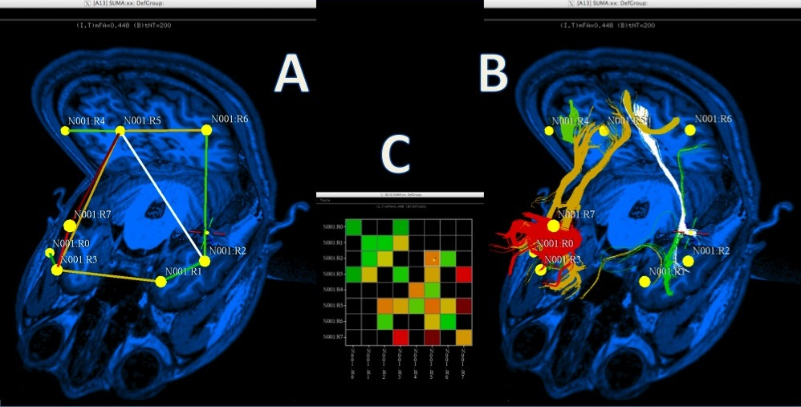
      
   **A**.Rendering of matrix data as a 3D graph. **B**.Graph edges represented by bundles. **C**.Matrix representation of connectivity data :ref:`(link)<HBM14_04>`

.. _highlights:

Highlights
==========

Multimodal rendering with direct AFNI link
------------------------------------------

.. figure:: media/image_HBM14_05.jpg
   :figwidth: 70%
   :align: center
   :target: ../_images/image_HBM14_05.jpg
   :name:    media/image_HBM14_05.jpg
   
   :ref:`(link)<media/image_HBM14_05.jpg>`

Multiple Linked Viewers
-----------------------

You can have up to 8 linked surface viewers open simultaneously.

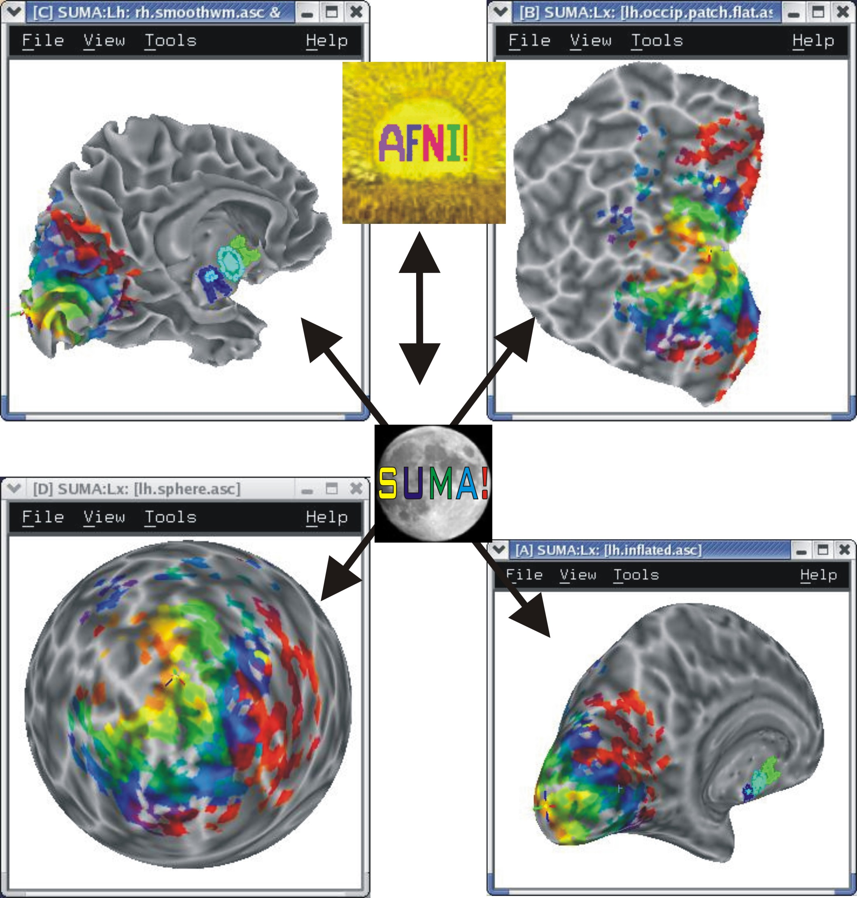
   
   :ref:`(link)<media/MultiView.jpg>`
   
.. container:: clearer
   
   .. image:: media/blank.jpg
   
ROI Drawing
-----------

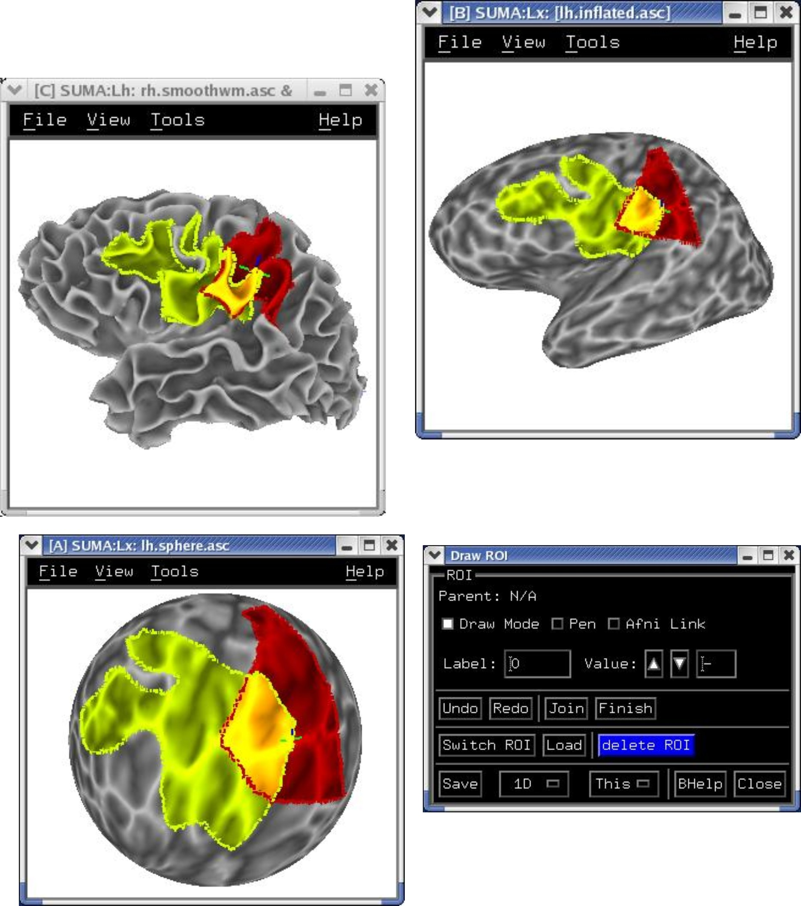
   
   :ref:`(link)<media/ROI_draw.jpg>`
   
.. container:: clearer
   
   .. image:: media/blank.jpg
   

Freehand ROI drawing in any viewer. See :ref:`drawing_ROIs`.

Simultaneous yoked left / right hemisphere display
--------------------------------------------------

.. figure:: media/both_smoothwm.jpg
   :figwidth: 30%
   :align: center
   :target: ../_images/both_smoothwm.jpg
   :name: media/both_smoothwm.jpg
   
   :ref:`(link)<media/both_smoothwm.jpg>`
   
   Most actions, such as dataset loading and parameter settings on one hemisphere are automatically carried out on the other hemisphere.

.. container:: clearer
   
   .. image:: media/blank.jpg
   

Templates of standard-space volumes in MNI and TLRC
--------------------------------------------------- 

If your volumetric data are in Talairach space, you can display them on these surfaces.

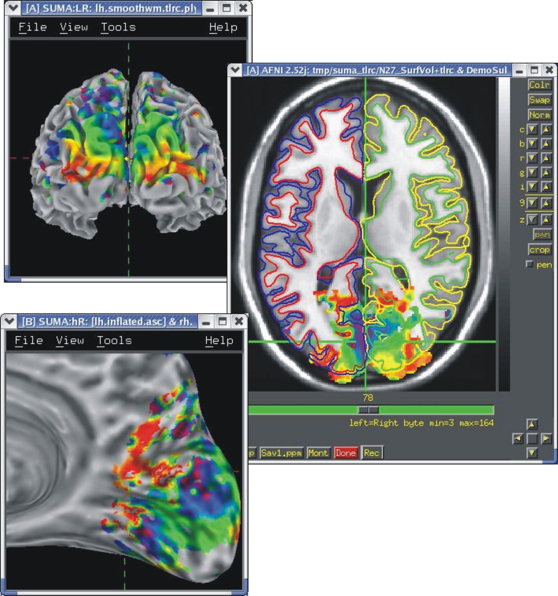
   
   See :ref:`Template Surfaces<TemplateSurfaces>` for details on obtaining the surfaces. :ref:`(link)<media/tlrc.jpg>`
   
.. container:: clearer
   
   .. image:: media/blank.jpg
   

Multi dataset color mapping with layering order and opacity controls
--------------------------------------------------------------------

Each dataset is colored interactively using SUMA's surface controller shown below. The color mapping of each dataset is stored in a separate color plane whose order and opacity can be controlled for each surface model.

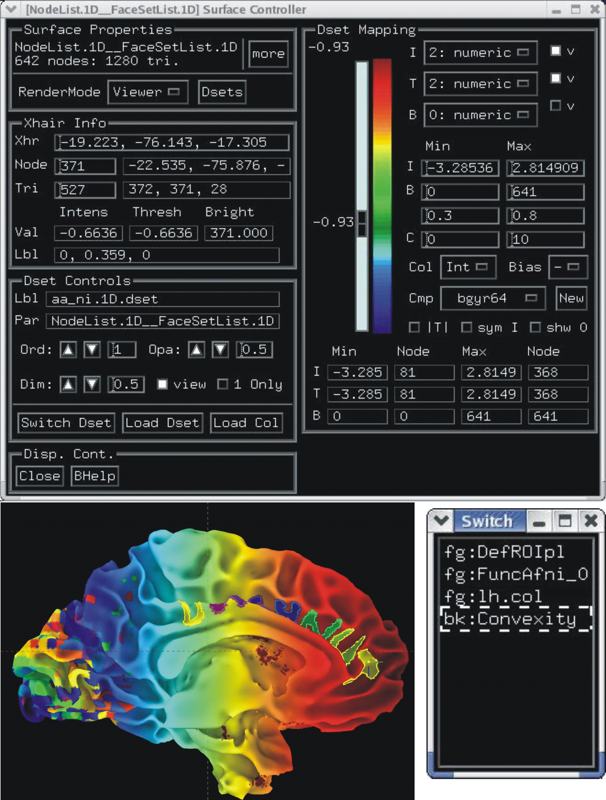
   
   surface models with 4 stacked color planes consisting of the surface convexity, drawn ROIs, functional data from AFNI  and a node color data file that looks cool. :ref:`(link)<media/ColPlanes2.jpg>`
   
.. container:: clearer
   
   .. image:: media/blank.jpg
   

Similarly, data coloring can be done for volumes, graphs, and  connectivity matrices.

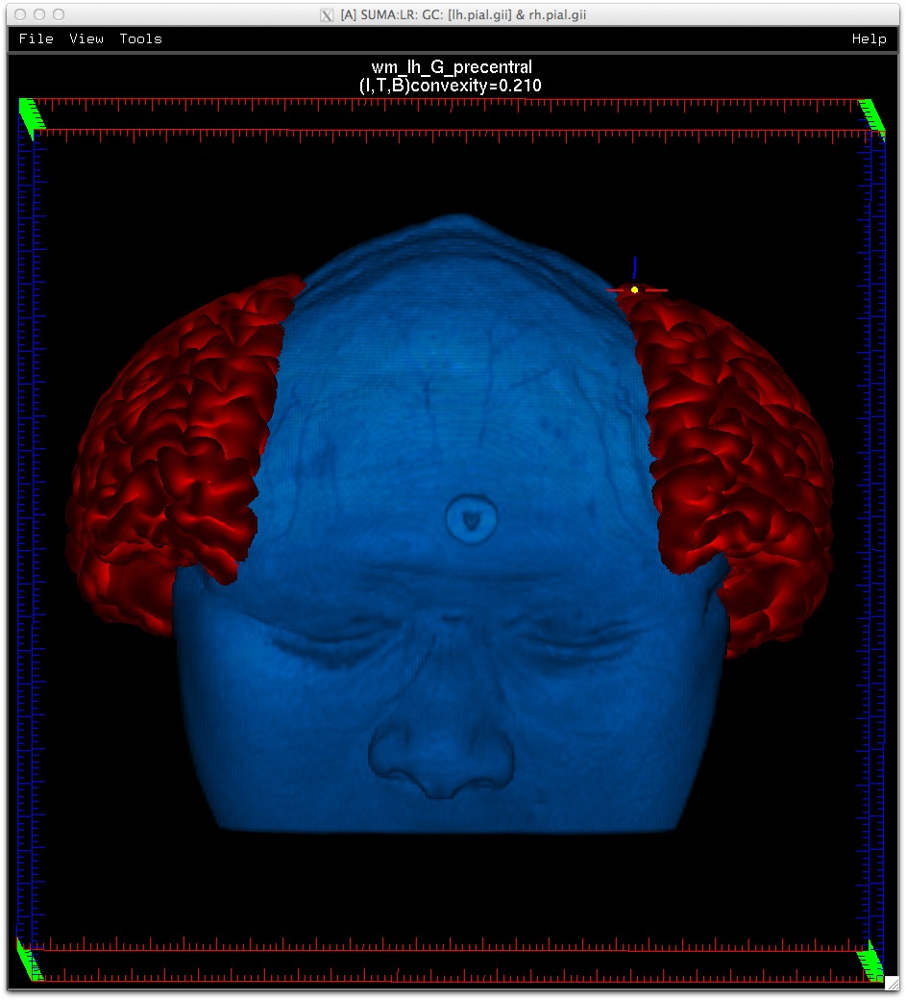
   
   :ref:`(link)<media/GC_3D.jpg>`
      
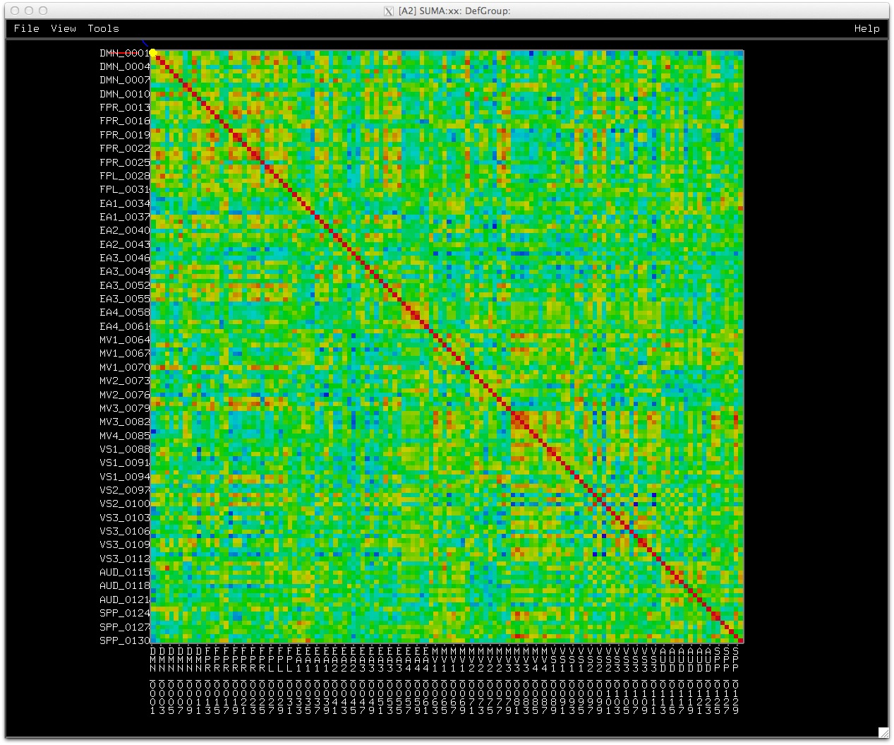
   
   :ref:`(link)<media/conn_matrix_01.jpg>`
   
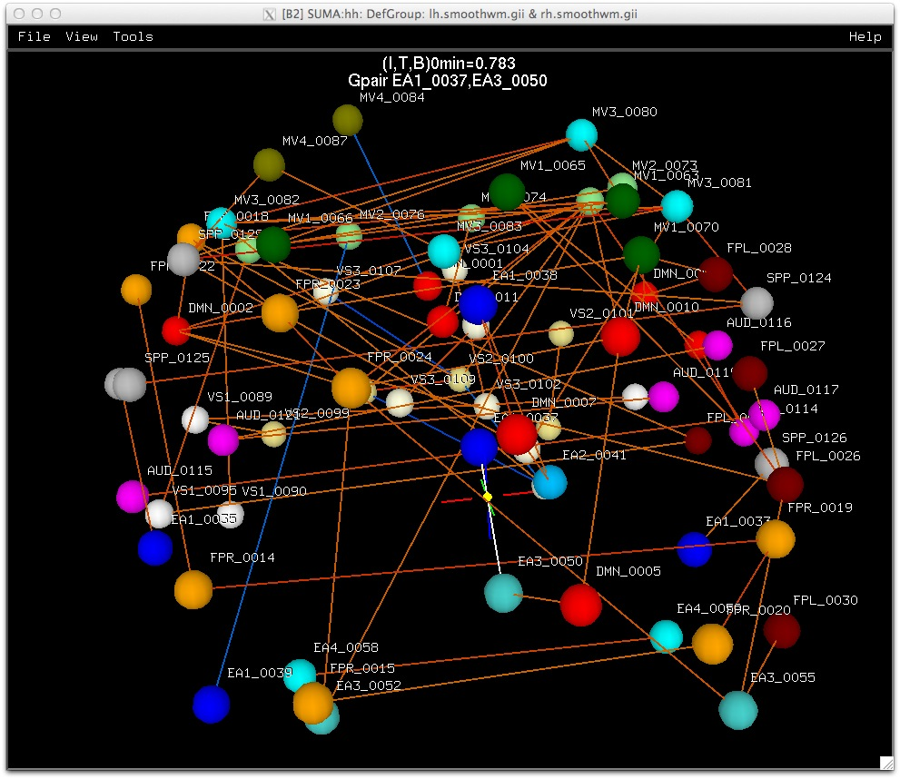
   
   :ref:`(link)<media/conn_matrix_02.jpg>`
   
.. container:: clearer
   
   .. image:: media/blank.jpg
   
   
Recording in continuous and single frame mode
---------------------------------------------

Rendered images can be :ref:`captured <LC_r>` by an AFNI-esque image viewers and saved into all formats provided by AFNI, including animated gifs and mpegs. Saving can also be done :ref:`directly <LC_Ctrl+r>` to disk.

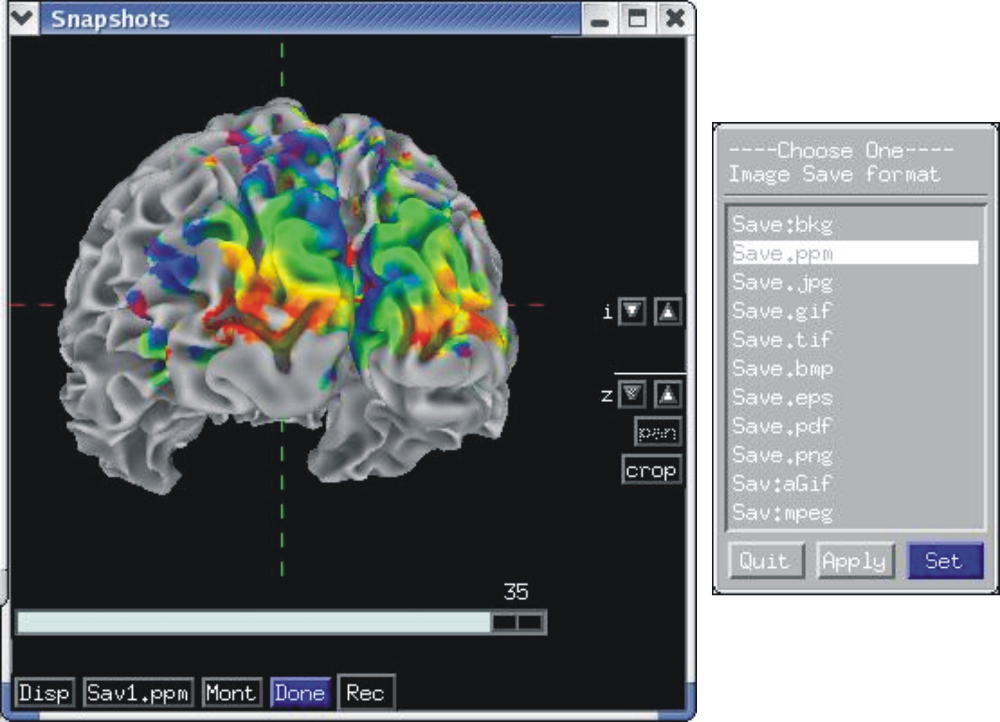
   
   :ref:`(link)<media/record_int.jpg>`
   
.. container:: clearer
   
   .. image:: media/blank.jpg

Automation of GUI behavior
--------------------------

You can automate the majority of tasks normally performed interactively. See demo scripts **@DriveSuma**, **@DriveAfni**, and **@DO.examples** available in the AFNI `distribution <https://afni.nimh.nih.gov/afni/download/afni/releases/latest>`_.

.. figure:: media/Drive_S+R_F3.jpg
   :figwidth: 90%
   :align: center
   :target: ../_images/Drive_S+R_F3.jpg
   :name: media/Drive_S+R_F3.jpg
   
   :ref:`(link)<media/Drive_S+R_F3.jpg>`

   Illustration for driving SUMA's GUI from the command line with DriveSuma. The example here illustrates the functioning of a script that automatically generates a movie of MEG SAM data from 0 to 600 ms after stimulus delivery. (Data and script to generate this movie are courtesy of Chunmao Wang, and available `here <https://afni.nimh.nih.gov/pub/dist/tgz/SumaMovieDemo.tgz>`_.

.. container:: clearer
   
   .. image:: media/blank.jpg
   
   

A library of command line programs for batch processing
-------------------------------------------------------

All voxelwise programs that make up the AFNI distribution will handle surface-based datasets. Operations such as smoothing and clustering that have their surface-based equivalent in **SurfSmooth** and **SurfClust**, for instance.

afni_proc.py, AFNI's pipeline generating program can easily turn a volume-based analysis into a surface-based one with the simple addition of two options.
 

Interactive Functional and Anatomical Connectivity
--------------------------------------------------

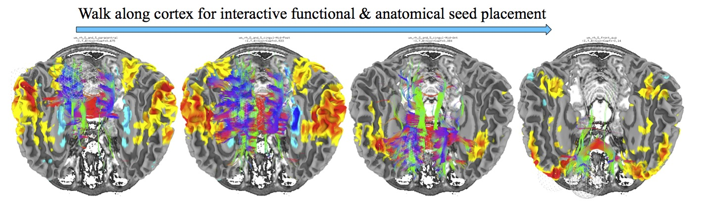
   
   :ref:`(link)<media/f+a_conn.jpg>`
   
Perform simultaneous, interactive functional and anatomical connectivity, all while maintaining a link to AFNI and original volumetric data. Use demo script **Do_09_VISdti_SUMA_visual_ex3.tcsh** which is part of the :ref:`FATCAT Demo<FATCAT_DEMO>` to walk through the process.  
