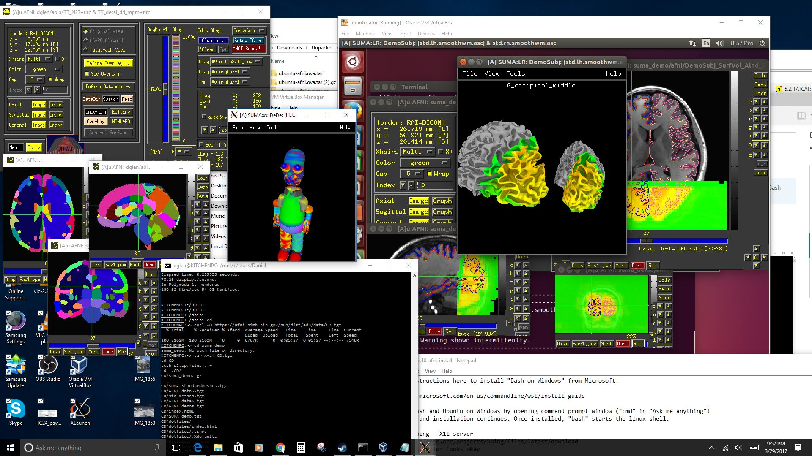

.. _install_steps_windows10:

**Windows 10, "Windows Subsystem for Linux (WSL)"**: *The essential system setup*
===========================================================================

.. contents:: :local:

Here we describe Linux installation and system setup for the **"Fall
Creators Update"** (FCU) version of Windows 10, known as the Windows
Subsystem for Linux (WSL).  This FCU was released in Windows version
1709 around October, 2017.

More technical/background description of updates since the earlier
beta version of WSL can be found `HERE on their "What's New" page
<https://blogs.msdn.microsoft.com/commandline/2017/10/11/whats-new-in-wsl-in-windows-10-fall-creators-update/>`_.
Mainly, the installation is a lot easier now, and one can even run
``tcsh`` shells.  Yippee.

Importantly, as with other installation instructions, you are required
to have administrator privileges on your operating system. 

Install prerequisite: Getting Linux
-----------------------------------

| Follow the short number of steps to install WSL described here,
  selecting "Ubuntu" as your desired flavor of Linux: 
| `https://docs.microsoft.com/en-us/windows/wsl/install-win10
  <https://docs.microsoft.com/en-us/windows/wsl/install-win10>`_

.. _install_windows_VcXsrv:

Install prerequisite: VcXsrv Windows X Server
---------------------------------------------

a. | Click on the following link to start automatic download:
   | `https://sourceforge.net/projects/vcxsrv/files/latest/download
     <https://sourceforge.net/projects/vcxsrv/files/latest/download>`_
   | Use default installation settings.  

#. *First* start the X Server, and *then* start Ubuntu.

   .. note:: From here on out, **whenever** you start up your WSL
             Ubuntu, you will need to double-click on the VcXsrv icon
             on your Desktop in order to start the X Server.  (Sorry,
             not our design!)

#. To enable copy+paste ability in Ubuntu terminal, right-click on the
   toolbar at the top of the Ubuntu terminal, and select "Properties";
   in the Options tab, make sure the box next to "QuickEdit Mode" is
   selected.  

   You should then be able to paste into a terminal by either
   right-clicking or hitting the "Enter" key.  (To "copy" text that is
   *in* the terminal, just highlight it, and then you should be able
   to right-click to paste; to "copy" text from *outside* the
   terminal, you probably need to highlight it and hit "Ctrl+c".)

#. To set the DISPLAY properly, copy+paste the following into the
   terminal::

     echo "export DISPLAY=:0.0" >> ~/.bashrc
     echo "setenv DISPLAY :0.0" >> ~/.cshrc

Install prerequisite: AFNI and  package dependencies
----------------------------------------------------

| We assume your version of Ubuntu is 16.04, and so you should follow
  the following setup instructions through "Make AFNI/SUMA profiles":
| :ref:`Link to Ubuntu 16+ setup instructions for AFNI <install_steps_linux_ubuntu16>`

**... while noting the following:**

* The *R* package installation part might be slow, on the order of
  hours.  Meditation is often a good thing, anyways.

* Include the optional ``gnome-terminal`` installation in the first
  set of steps, and copy+paste this into the terminal::

    echo "export NO_AT_BRIDGE=1" >> ~/.bashrc
    echo "setenv NO_AT_BRIDGE 1" >> ~/.cshrc

Useful setup tips (optional, but recommended)
---------------------------------------------

a. Install Ubuntu terminal fonts as described `HERE
   <https://www.howtogeek.com/249966/how-to-install-and-use-the-linux-bash-shell-on-windows-10/>`_.

#. Follow these ``gnome-terminal`` steps:

   * The default profile "use colors from system theme" shows an
     all-black terminal.  To fix this: go to the terminal's menu bar,
     select the ``Edit`` tab, then ``Profile``, turn **off** "use
     colors ...", and just pick a scheme+palette that you like.

   * In gnome-terminal, everything is standard and similar to other
     linux implementations, and the middle button pastes whatever is
     selected in the WSL terminal or other gnome-terminal.
     Shift-Ctrl-c copies, and Shift-Ctrl-v also pastes.

.. 
    #. Like most Linux systems, some things have to be done with ``sudo``
       permissions. The username and password may have nothing to do with
       their Windows login. To reset the password for user
       ``USER_X``, follow these instructions:

       * From the default command window, type ``Super[windowskey]+X``,
         then ``A``.  You can change the default user to root::

           lxrun /setdefaultuser root

       * Now BoUoW logs you in as root without asking password. To change
         the user password::

           passwd USER_X

       * Change the default user back to your normal user in Windows
         command prompt::

           lxrun /setdefaultuser USER_X

.. ---------- HERE/BELOW: copy for all installs --------------

Make AFNI/SUMA profiles
-----------------------

.. include:: substep_profiles.rst

Prepare for Bootcamp
--------------------

.. include:: substep_bootcamp.rst

Evaluate setup/system (important!)
----------------------------------

.. include:: substep_evaluate.rst

Niceify terminal (optional, but goood)
--------------------------------------

.. include:: substep_rcfiles.rst

Keep up-to-date (remember!)
---------------------------

.. include:: substep_update.rst

   

