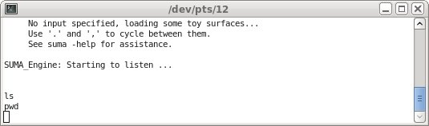
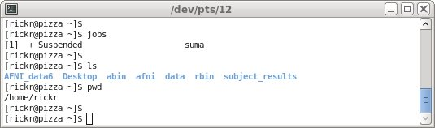

.. _U_basic_2:

********************************************************
Basic Unix : :command:`bg` and :command:`fg` processes
********************************************************
Shifting a process between the foreground and the background

.. note:: overview:
   - After starting a 

A foreground process is one that occupies your shell (terminal window), meaning that any new commands that are typed have no effect until the previous command is finished.  This is as we might expect, but can be confusing when we run long lasting programs, such as the :command:`afni` or :command:`suma` GUI (graphical user interface).

.. note:: :command:`afni` is no longer appropriate as the example for this, since it now runs in the background by default (it creates a child process and returns the user to an active command prompt).  So suma will now be used for this demonstration.
..

   Commands and descriptions:

   - `suma <https://afni.nimh.nih.gov/pub/dist/doc/program_help/suma.html>`_ : the main AFNI GUI for viewing surface data
   - :ref:`U_mcc_ctrl_z` : keystroke: suspend the foreground process
   - :ref:`U_mc_bg` : put the recently suspended process in the background
   - :ref:`U_mc_fg` : put the recently suspended process in the foreground
   - :ref:`U_mcc_amp` : run a program in the background to begin with
   - :ref:`U_mc_jobs` : list child processes under terminal shell

start :command:`suma`
---------------------
Start :command:`suma` (from any directory).  It will display a random dataset (which can be changed with '.').

   commands (type these in the terminal window)::

        suma

When the :command:`suma` GUI is opened, it shows us something (a random internal dataset of its choosing), which will vary.  But this is about Unix, so we do not care what it shows.

To see that :command:`suma` is active, use the left mouse button (press and hold) to "grab" the surface data and rotate it around.

.. image:: media/basic_2_A.jpg
   :align: center
   :width: 80%
..

.. seealso:: `suma -help <https://afni.nimh.nih.gov/pub/dist/doc/program_help/suma.html>`_

fail to do anything
-------------------
Try to type commands in the original terminal window.

Locate the terminal window from which :command:`suma` was launched.  Try to enter some commands into it.

   commands (type these in the terminal window)::

        <Enter>
        <Enter>
        ls
        pwd
        <Enter>

We get no prompt and the commands have no effect.

That is because the :command:`suma` program is running in the foreground of the terminal shell.  The shell is occupied by :command:`suma`.

..

suspend :command:`suma`
-----------------------
In the terminal window, press :command:`ctrl-z` (hold the ctrl key and press 'z').

   commands (type these in the terminal window)::

        ctrl-z
        jobs

The terminal window shows 'Suspended'.  That refers to the :command:`suma` program, meaning that :command:`suma` is no longer running, but the terminal is available.

The :command:`jobs` command also shows that :command:`suma` is suspended.

.. image:: media/basic_2_C.jpg
   :align: center
   :width: 80%

try, try, again
---------------
Repeat of "fail to do anything": try to type commands in the terminal window.

   commands (type these in the terminal window)::

        <Enter>
        <Enter>
        ls
        pwd
        <Enter>

This time the commands work.  The :command:`suma` program is no long occupying the terminal shell.

is :command:`suma` broken?
--------------------------
Try to use the :command:`suma` GUI.

Try to use the left mouse button to grab and rotate the surface again.

Next grab a different window (maybe the terminal or web browser), move it to partially obscure the :command:`suma` window, and then move it back away.

The windows basically get erased, maybe leaving copies of the obscuring image in the :command:`suma` window.  The :command:`suma` image is no longer getting re-drawn by the window manager.  This shows us that ':command:`suma`' is no longer running (since it was suspended).

.. image:: media/basic_2_E.jpg
   :align: center
   :width: 80%

wake up, :command:`suma`!
-------------------------
Put :command:`suma` into the background, then try to use it again.

Find the same terminal window again and enter the :command:`bg` command (for background).  But watch the :command:`suma` GUI when you hit <Enter>.

   commands (type these in the terminal window)::

        bg
        jobs

Notice that :command:`suma` started running again, as soon as the :command:`bg` command was entered.  Also, notice that we can still enter commands into the terminal window.  So not only is afni running, but we have access to the shell.

Also, notice that :command:`jobs` shows that :command:`suma` is running.

.. image:: media/basic_2_F.jpg
   :align: center
   :width: 80%

start over
----------
Be efficient.  Run ':command:`suma`' in the background to begin with.  Then :command:`ctrl-z` and :command:`bg` would not be needed.

Start by closing the current :command:`suma` GUI.  Use the 'x' in the upper corner of the window, or hit `<esc>` in the :command:`suma` image window, and click on Yes to close (or just hit `<Enter>`).

Now re-start :command:`suma`, putting the :command:`&` character after the command.

   commands (type these in the terminal window)::

        suma &

Now :command:`suma` is in the background to begin with.  We can use :command:`suma` and we can type commands in the terminal window.

.. note::
   If a program is running in the background, any text output from the
   background program will still appear in the same terminal window, which
   can be confusing.

