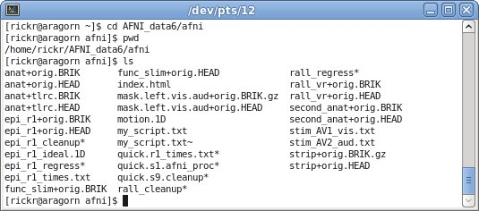
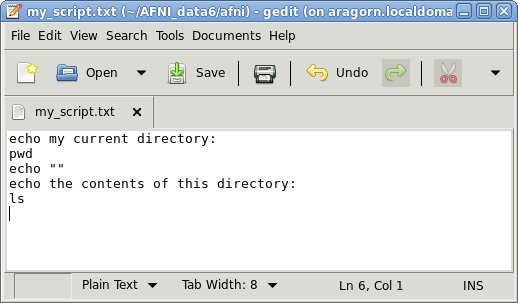

.. _U_basic_3:

*****************************************
Basic Unix : light intro to shell scripts
*****************************************

   Commands and descriptions:

   - :ref:`U_mc_cat` : (catenate) show file contents in terminal window
   - :ref:`U_mc_tcsh` : what is the t-shell
   - :ref:`U_mb0_tcsh`
   - :ref:`U_mc_gedit` : a graphical editor

What are shell scripts?

   A shell script is a simple text file that contains commands in some shell
   language, e.g. :command:`bash`, :command:`tcsh`, :command:`python`,
   :command:`matlab`.  Our focus is on :command:`Unix` and :command:`AFNI`
   commands using :command:`tcsh` syntax (though the syntax used in this
   particular tutorial page could apply to either :command:`bash` or
   :command:`tcsh`).

   A shell script could be typed directly into a terminal window, but is
   written into a text file so that it can be edited, executed multiple
   times, and saved as a history of processing.  For these reasons, using
   shell scripts for data processing is highly recommended.

   **Essentially, all processing for published research ought to be done
   via shell scripts.**

Inspect AFNI_data6/afni
-----------------------
Go to the AFNI_data6/afni directory and see what is there.

   commands (type these in the terminal window)::

        cd AFNI_data6/afni
        pwd
        ls

   There are anatomical, EPI, statistical and mask datasets here, along with
   scripts (text files of commands, such as rall_regress) and stimulus timing
   files (text files of times in seconds, such as stim_AV1_vis.txt).

Write a simple script
---------------------

   Create a text file that shows which directory we are in, and also shows
   the directory contents.  Open a text editor to create a file called
   'my_script.txt'.  Open it in the background, so that the prompt is
   returned, enabling us to type more commands in this window.

   commands (type these in the terminal window)::

        gedit my_script.txt &

   If you forget to use :command:`&`, either close :command:`gedit` and try it
   again or remember to try :command:`ctrl-z` and :command:`bg` in the terminal
   window (not in the :command:`gedit` window).

   Type the following into the script::

        echo my current directory:
        pwd
        echo ""
        echo the contents of this directory:
        ls

   And save the script.

.. note:: How the ``gedit`` window looks will depend on the operating system
          and environment.

Verify that the script exists
-----------------------------
Use :command:`ls` to verify that the :file:`my_script.txt` is now in the current (AFNI_data6) directory.

   Use :command:`ls` just to verify that that :file:`my_script.txt` is there.
   Do it from the terminal window that was used to run :command:`gedt`.  Use
   :command:`ls -l` to get a long listing on the text file, including the size
   of the file and the date and time it was created.

   commands (type these in the terminal window)::

        ls
        ls -l my_script.txt

.. image:: media/basic_3_C.jpg
   :align: center
   :width: 80%

Display script contents
-----------------------
Display the contents of the script.

   From the same command line (not in the editor), display the contents of
   the newly created script.  Use the 'cat' command quickly show the contents
   of the file in the terminal window.
     
   commands (type these in the terminal window)::

        cat my_script.txt

   Of course, it should look exactly like what we just typed in the editor.
   We did not run the script, we just displayed it as text.

.. image:: media/basic_3_D.jpg
   :align: center
   :width: 80%

Run the script
--------------
Execute the script from the command line.

   Actually run the script now, using 'tcsh'.  This should behave as if the
   commands were typed into the terminal window.  Think about what the output
   should be before running the script.

   commands (type these in the terminal window)::

        tcsh my_script.txt

   This tells tcsh to process my_script.txt as if those commands were typed
   at the prompt.  The output should look (something) like the following:

.. image:: media/basic_3_E.jpg
   :align: center
   :width: 80%

.. note::

   - the :command:`echo` command just displays the text in the terminal
   - the :command:`echo ""` command echos a blank line (to separate output)
   - depending on any alias for the :command:`ls` command, there may be color
     or special characters in the output

.. seealso::

   - :ref:`U_mc_echo`
   - :ref:`U_mc_ls`
   - :ref:`double quotes <U_mcc_dquote>`

