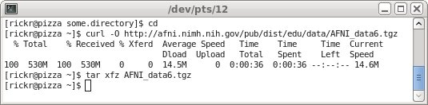
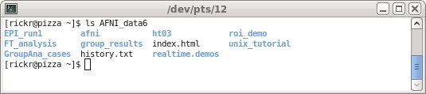

.. _U_misc_installing_data:

*****************************************
Installing AFNI_data6 (sample class data)
*****************************************

In a typical AFNI bootcamp, the AFNI_data6 directory will be put under the $HOME directory.

The following commands will download it and place it in the $HOME directory::

   cd
   curl -O https://afni.nimh.nih.gov/pub/dist/edu/data/AFNI_data6.tgz
   tar xfz AFNI_data6.tgz

The output might look like:

Data installation is part of setting up a computer for an AFNI bootcamp.  For full details, see: `howto: class setup <https://afni.nimh.nih.gov/pub/dist/HOWTO/howto/ht00_inst/html/class_setup.html>`_

A simple test
-------------
Make sure that AFNI_data6 is installed via the 'ls' command::

   ls AFNI_data6

The result should show the contents of that directory, such as:

   - the afni directory
   - the FT_analysis directory
   - the unix_tutorial directory (which contains this tutorial)
   - history.txt

