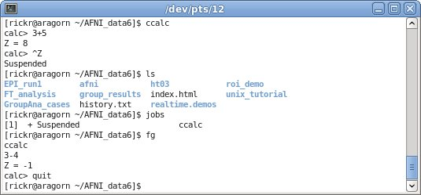

.. _U_misc_commands:

***********************
Unix and shell commands
***********************

Tcsh shell commands, Unix commands and special key strokes

.. note:: for getting help in Unix, try the "manual" pages: :command:`man COMMAND`


Shell commands are particular to the shell (:command:`tcsh`, in this case).

Unix commands are common to all Unix systems, though options vary a bit.

Special characters may apply to Unix in general, or be particular to a shell.


.. _U_mc_shell_commands:

Shell Commands
==============

A shell command is one that is processed internally by the shell.  There is no corresponding executable program.

Take `cd` for instance.  There is no `/bin/cd` program, say, and `which cd` specifies that it is a built-in command.  It is part of the shell.  The `cd` command is processed by the shell (`tcsh` or `bash`, say).

Contrast that with `ls`.  There is a `/bin/ls` program, as noted by `which ls`.  The shell does not process `ls` internally.

.. seealso:: for geting help from the shell, use :command:`man`, e.g.

    - :command:`man tcsh`
    - :command:`man bash`


.. _U_mc_bg:

bg
--
put the most recently accessed job (child process) in the background

This is most commonly entered after :command:`ctrl-z`.  One might also use the output of :command:`jobs`, and specify a job number.

.. seealso:: :command:`man tcsh`


.. _U_mc_cd:

cd
--
change directories

The `cd` command is used to change directories.  Without any parameters, the shell will change to the user's home directory (`$HOME`).  Otherwise, it will change to the single specified directory.  

   Examples::

      cd
      cd $HOME
      cd suma_demo
      cd AFNI_data6/FT_analysis
      cd ~username
      cd /absolute/path/to/some/directory
      cd relative/path/to/some/directory
      cd ../../some/other/dir

Since `..` is the parent directory, including such entries will travel up the directory tree.

.. note:: It is a good idea to follow a `cd` command with `ls` to list the contents of the new directory.

.. seealso:: :command:`man tcsh`


.. _U_mc_echo:

echo
----
echo text to the terminal window

The echo command displays the given text on the terminal window.  This is often used to show the user what is happening or to prompt for a response.  There are more devious uses, of course...

   Examples::

      echo hello there
      echo "this section performs volume registration"
      set my_var = 7
      echo "the value of my_var = $my_var"

.. seealso:: :command:`man tcsh`


.. _U_mc_fg:

fg
--
put the most recently accessed job (child process) in the foreground

This is most commonly entered after :command:`ctrl-z`.  One might also use the output of :command:`jobs`, and specify a job number.

While :command:`bg` keeps a process running, but leaves the terminal window available for new commands, :command:`fg` puts a process in the foreground, so commands would no longer be available.

See also: :ref:`U_mc_bg`

.. seealso:: :command:`man tcsh`

.. _U_mc_jobs:

jobs
----
list processes started from current shell

The ``jobs`` command lists processes that have been started from the current shell (the current terminal window, probably) that are either suspended or running in the background.  Processes are suspended via ``ctrl-z``, and can then be put into the background using the ``'bg``' command (or by using ``&`` in the first place).

   Examples::

      jobs              - probably shows nothing


.. seealso::

   - :command:`man tcsh`
   - the example from: :ref:`U_mcc_ctrl_z`

.. _U_mc_set:

set
---
assign a value to a shell variable

The set command assigns a value to a variable (or multiple values to multiple variables).  Without any options, all set variables are shown.

If a value has spaces in it, it should be contained in quotes.  If a list of values is desired, parentheses `()` should be used for the assignment, while indivisual access is done via square brackets `[]`.

   Examples::

      set
      set value = 7
      set new_val = "some number, like seven"
      echo $new_val
      set list_of_vals = ( 3 1 4 one five )
      echo $list_of_vals
      echo $list_of_vals[3]
      set path = ( $path ~/abin )

.. note:: A single `set` command can be used to set many variables, but such a use is not recommended.

.. note:: `set` is for setting shell variables, which do not propagate to child shells.  To propagate to a child shell, use **environment variables**.  A child shell would be created when a new shell is started, such as when running a script.

   - setenv DYLD_FALLBACK_LIBRARY_PATH $HOME/abin

.. seealso::

   - :command:`man tcsh`
   - :ref:`U_mc_setenv`.


.. _U_mc_setenv:

setenv
------
set an environment variable

The setenv command works like 'set', except that if a child shell is started (such as when running a script), the environment variables are preserved.  Note that environment variables are generally in all caps by convention, to visually distinguish them from regular shell variables.

Lists are assigned using the bash-like syntax of ':' delimited elements, rather than with '()' and space delimited elements as 'set' uses.  When a list is added to, as with the $PATH example, the variable should be within '{}', so that the ':' does not look like a modifier (i.e. using ${PATH} rather than just $PATH).

   Examples::

      setenv MY_ENV_VAR "some value"
      setenv PATH ${PATH}:$HOME/abin
      setenv DYLD_FALLBACK_LIBRARY_PATH $HOME/abin

   Examples of similar commands using :command:`bash`::

      name="Maria Buttersworth"
      export name
      export name="Maria Buttersworth"
      export DYLD_FALLBACK_LIBRARY_PATH=$HOME/abin

For more help, see ``man tcsh``.

.. seealso::

   - :ref:`U_mc_set`
   - :ref:`U_mc_unsetenv`


.. _U_mc_unset:

unset
-----
delete a shell variable

This does not just clear the variable, but makes it "not exist".

   Examples::

      set value = 7
      echo $value
      unset value
      echo $value

   The result of the last ``echo $value`` command would produce an error,
   since that variable no longer exists.

.. seealso::

   - :ref:`U_mc_set`
   - :ref:`U_mc_unsetenv`


.. _U_mc_unsetenv:

unsetenv
-----------------------------------------
delete an environment variable

This does not just clear the variable, but makes it "not exist".

   Examples::

      unsetenv DYLD_FALLBACK_LIBRARY_PATH
      unsetenv AFNI_NIFTI_DEBUG

.. seealso:: :ref:`U_mc_setenv`


.. _U_mc_unix_commands:

Unix Commands
=============

A Unix command is a command that refers to an actual file on disk.  There is a
``/bin/ls`` file, but there is no file for ``cd``.

   Example commands to consider::

      which cat
      which cd
      which ls
      which afni

.. _U_mc_cat:

cat
---
display file contents in terminal window

The cat command, short for catenate, is meant to dump all files on the command line to the terminal window.

   Examples::

      cat AFNI_data6/FT_analysis/s01.ap.simple
      cat here are four files
      cat here are four files | wc -l

.. seealso:: :command:`man cat`

.. _U_mc_gedit:

gedit
-----
a text editor for the GNOME Desktop

The gedit program is a graphical text editor that works well across many Unix-like platforms.  If you are not sure which editor to use, gedit is a good option.  It often needs to be explicitely installed.

   Examples::

      gedit
      gedit my_script.txt
      gedit output.proc.subjFT.txt

.. seealso::

   - :command:`man gedit`
   - `wiki.gnome.org/Apps/Gedit <https://wiki.gnome.org/Apps/Gedit>`_
   - `en.wikipedia.org/wiki/Gedit <http://en.wikipedia.org/wiki/Gedit>`_


.. _U_mc_less:

less
----
a text file viewer

rcr - add this

.. _U_mc_ls:

ls
--
list directory contents

The 'ls' command lists the contents of either the current directory or the directories listed on the command line.  For files listed on the command line, it just lists them.

Multiple directories may be listed, in which case each directory is shows one by one.

   Examples::

      ls
      ls $HOME
      ls AFNI_data6/afni
      ls AFNI_data6/afni AFNI_data6/FT_analysis/FT ~

      ls -al
      ls -ltr
      ls -ltr ~
      ls -lSr dir.with.big.files

   Common options::

      -a  : list all files/directories, including those starting with '.'
      -l  : use the long format, which includes:
            type, permissions, ownership, size, date (may vary per OS)
      -t  : sort by time (modification time)
      -r  : reverse sort order
      -S  : sort by size of file (e.g. 'ls -lSr')

.. note: Alphabetical sorting depends on LC_COLLATE (or LC_ALL).  To sort in ASCII order, with upper-case first, set the LC_ALL environment variable to C.

.. seealso:: :command:`man ls`

.. _U_mc_pwd:

pwd
---
display the Present Working Directory

The pwd command just shows the present working directory.

   Examples::

      pwd

.. seealso:: :command:`man pwd`

.. _U_mc_tcsh:

tcsh
----
t-shell

This shell (user command-line interface) is an expanded c-shell, with syntax akin to the C programming language.  One can start a new tcsh shell by running this command, or one can tell the shell to interpret a script.

   Examples::

      tcsh
      tcsh my.script.txt
      tcsh -xef proc.subj1234 |& tee output.proc.subj1234

.. seealso:: :command:`man tcsh`


.. _U_mc_special_characters:

Special characters
==================
Special characters and keystrokes (get extra help from a Unix book)

.. seealso::

   - :command:`man tcsh`
   - :command:`man bash`
   - a Unix book

Special characters refer to those that have special functions when used in
tcsh command or scripts.  Special keystrokes refer to those that apply to a
terminal window shell with sub-processes.

.. _U_mcc_amp:

``&``
-----
run some command in the background

Putting a trailing `&` after a command will have it run in the background, akin to omitting it and typing `ctrl-z` followed by `bg`.

   Examples::

      suma -spec subj_lh.spec -sv SurfVol+orig &
      tcsh run.my.script &

Some other uses for `&` include conditional (`&&`) and bitwise ANDs (`&`), as well as piping (`|&`) and redirection (`>&`) of stderr (standard error).

.. seealso:: :ref:`U_mcc_ctrl_z`


.. _U_mcc_backslash:

``\``
-----
line continuation (or escaping)

Putting a trailing \\ at the end of a command line tells the shell that the
command continues on the next line.  This could continue for many lines.

   Examples::

      echo this is all one long    \
           command, extending over \
           three lines

   Note that the latter two lines were indented only to clarify that
   :command:`echo` was the actual command name, while the other text
   items were just parameters.

Another use is to tell the shell not to interpret a special character or
an alias.

   More examples::

      ls $HOME
      ls \$HOME
      echo *
      echo \*
      ls
      \ls

Some programs allow for a similar interpretation (and other interpretations).

.. _U_mcc_pound:

``#``
-----
pound/hash character: apply as comment or return list length

The pound character has 2 main uses in a t-shell script, to start a comment
or to return the length of an array.  

In a shell script, if ``#`` is not hidden from the shell (in quotes or
escaped with ``\``), then from that character onward is ignored by the
shell, as if it were not there.  The point of this is to allow one to
add comments to a script: text that merely tells a reader what the script
is intending to do.

   For example, if a t-shell script had these lines::

      set greeting = pineapple
      # check whether user wants to say "hi" or "hello"
      if ( $greeting == hi ) then
         # the short greeting
         echo hi there
      else 
         echo hello there   # this is a strange place for a comment
      endif

Then the "check whether user wants" line does not affect the script,
nor does the comment "this is a strange place for a comment".

The output is simply, "hello there".

   .. note::

      Pound characters entered at the command line are not treated as comments,
      they are treated as any other simple text (possibly because the shell
      authors did not see any reason why one might want comments at the command
      line, such as for when cutting and pasting scripts).


Another use of ``#`` is to get the length of a shell array variable, such
as ``$path``.  For example::

      echo my path has $#path directories in it
      echo the full list is: $path

   .. note:: this use does not apply to environment variables, such as $PATH

.. _U_mcc_squote:

``'``
-----
single quotes

Enclosing text in single quotes tells the shell not to interpret (most of) the enclosed special characters.  This is particularly important for cases where special characters need to be passed to a given program, rather than being interpreted by the shell.

With respect to scripting, the most important difference between single and double quotes is for enclosed ``$`` characters, such as with ``$HOME``, ``$3`` or something like ``$value``.  Such variable expansions would occur within double quotes, but not within single quotes.

   .. note:: back quotes ````` are very different from single ``'`` or double ``"`` quotes

   Examples::

      3dcalc -a r+orig'[2]' -expr 'atanh(a)' -prefix z
      awk '{print $3}' some.file.txt
      echo 'my home directory is $HOME'

   The first example uses 3dcalc to convert a volume of r-value (correlation
   values) via the inverse hyperbolic tangent function (a.k.a. Fisher's 
   z-transformation).  The first set of quotes around ``[2]`` hide the ``[]``
   characters from the shell passing them on to 3dcalc.  Then the 3dcalc
   program knows to read in only volume #2, ignoring volumes 0, 1 and
   anything after 2.

   If the ``[]`` characters were not protected by the quotes, it would likely
   lead to a "No match" error from the shell, since the square brackets are
   used for wildcard file matching.

   Alternatively, the quotes could alter go around the entire ``r+orig[2]``.

   The quotes around ``atanh(a)`` are to hide the ``()`` characters, again so
   that 3dcalc sees that entire expression.


   The second example hides both the ``{}`` and ``$`` characters.  Note that
   ``$`` is most commonly used to access variable values, such as in ``$HOME``.


   The third example just clarifies that shell variables are not expanded,
   since the output shows ``$HOME`` and not ``/home/rickr``, for example.

.. seealso:: :ref:`double quotes <U_mcc_dquote>`

.. _U_mcc_dquote:

``"``
-----
double quotes

Enclosing text in double quotes tells the shell not to interpret some of the enclosed special characters, but not as many as with single quotes.  This is particularly important for cases where special characters need to be passed to a given program, rather than being interpreted by the shell.

With respect to scripting, the most important difference between single and double quotes is for enclosed ``$`` characters, such as with ``$HOME``, ``$3`` or something like ``$value``.  Such variable expansions would occur within double quotes, but not within single quotes.

   .. note:: back quotes ````` are very different from single ``'`` or double ``"`` quotes

   Examples::

      3dcalc -a r+orig"[$index]" -expr "atanh(a)" -prefix z
      echo "my home directory is $HOME"

   These examples just demonstrate use of variables within double quotes.
   The first one uses ``$index`` as a sub-brick selector with AFNI's `3dcalc`
   program.  In this case, ``$index`` might expand to 2, as in the example
   using single quotes.

   The second example (with ``$HOME``) is similar to the one with single
   quotes.  But the double quote output shows ``$HOME`` expanded to the home
   directory (e.g. `/home/rickr`), while the single quotes output does not
   (it still shows ``$HOME``).

.. seealso:: :ref:`single quotes <U_mcc_squote>`


.. _U_mcc_bquote:

:command:`\``
-------------
back quotes

Back quotes are very different from single or double quotes.  While single and
double quotes are commonly used for hiding special characters from the shell,
back quotes are used for command expansion.

When putting back quotes around some text, the shell replaces the quoted text
with *the output of running the enclosed command*.  Examples will make it more
clear.

   Examples::

      echo my afni program is here: `which afni`
      count -digits 2 1 6
      set runs = "`count -digits 2 1 6`"
      echo there are $#runs runs, indexed as: $runs
      set runs = ( `count -digits 2 1 6` )
      echo there are $#runs runs, indexed as: $runs

   The first example runs the command ``which afni``, and puts the result
   back into the echo command.  Assuming afni is at ``/home/rickr/abin/afni``,
   the first command is as if one typed the command:

        ``echo my afni program is here: /home/rickr/abin/afni``

   The second example line (``count -digits 2 1 6``) simply shows the output
   from the AFNI ``count`` program, zero-padded 2 digit numbers from 1 to 6.

   The third line captures that output into a variable.  Going off on a small
   tangent, that output is stored as a single value (because of the double
   quotes).  

   The fourth line displays that output in the terminal window.  In this case,
   the ``$runs`` variable has only 1 (string) value, with spaces between the 6
   run numbers.

   The fifth line (again with ``set runs``) sets the ``$run`` variable using
   parentheses, storing the output as a list (an array) of 6 values).

   The final ``echo`` line shows the same output as the previous ``echo`` line,
   except that now it shows that there are indeed 6 runs.

.. image:: media/misc_umcc_bquote.jpg
   :align: center
   :width: 80%

.. seealso::

   - :ref:`U_mc_set`
   - :ref:`double quotes <U_mcc_dquote>`
   - :ref:`single quotes <U_mcc_squote>`
   - :command:`man tcsh`
   - `afni -help <https://afni.nimh.nih.gov/pub/dist/doc/program_help/afni.html>`_
   - `count -help <https://afni.nimh.nih.gov/pub/dist/doc/program_help/count.html>`_

.. _U_mcc_ctrl_c:

ctrl-c
------
terminate a running process (in the current terminal window)

The ctrl-c (while holding the control key down, press c) keystroke is used to terminate the foreground process in the current shell (by sending it a SIGINT signal).  It is similar to ctrl-z, but rather than suspending a process, ctrl-c terminates it.
 
This might be useful when running a shell script that would take a while to complete.  Maybe you decide to make a change, or error messages start coming out.  If that script is running in the foreground, entering ctrl-c should terminate it.

   Example::

      1. run 'ccalc'
         (the prompt is now waiting for an input expression to evaluate)
      2. type 3+5 and hit <Enter>
         (it should show the result: Z = 8)
      3. terminate the program with ctrl-c
         (the prompt should now be back)

.. seealso::

   - :ref:`U_mcc_ctrl_z`
   - `ccalc -help <https://afni.nimh.nih.gov/pub/dist/doc/program_help/ccalc.html>`_


.. _U_mcc_ctrl_z:

ctrl-z
------
suspend a running process

The ctrl-z (while holding the control key down, press z) keystroke is used to suspend the foreground process in the current shell.  The process still exists, but will not run while in the suspended state.

This keystroke is often followed by ``bg`` (background: a built-in shell command), to put the newly suspended process in the background.  Alternatively, it could be followed by ``fg`` (foreground: a build-in shell command), to put the suspended process back in the foreground, as it was in the first place.

   Example::

      ccalc
      3+5               - should show the result Z = 8
      ctrl-z            - process 'Suspended', prompt should be back
      ls                - works, can type other commands
      jobs              - shows that 'ccalc' is still suspended
      fg                - put 'ccalc' back in the foreground
      3-4               - should show the result Z = -1
      quit              - quit ccalc program



.. seealso::

   - :ref:`U_mc_jobs`
   - `ccalc -help <https://afni.nimh.nih.gov/pub/dist/doc/program_help/ccalc.html>`_


todo::

   rcr - consider adding any of these over time...
   *, ?, [], !, |, :, ~, %, (, {, <, > 
