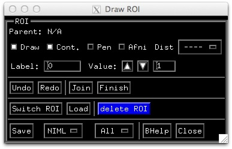

.. _drawing_ROIs:

================
**Drawing ROIs**
================

You can draw Regions Of Interest (ROIs) directly on the surface models. To do so, you must first open the Draw ROI GUI with :kbd:`control-d` or :menuselection:`Tools --> Draw ROI`. An ROI can be a single :index:`node`, a curve (formed by connected nodes), a loop (or a closed curve or contour) and a filled loop. We begin with a small demo followed by a description of the GUI.

.. _Draw_ROI_GUI:

   
   :ref:`The Draw ROI GUI<media/Draw_ROI_GUI.jpg>`

 
Demo:
-----

#. In the Surface Viewer window, open the DrawROI GUI with :ref:`Ctrl+d<LC_Ctrl+d>` or :menuselection:`Tools --> Draw ROI`. 

.. _Draw_ROI_Mode:

#. When you first open the DrawROI controller SUMA will be in :term:`Draw ROI Mode`. This is indicated by the cursor's shape changing from arrow to concentric circles. In drawing mode, you draw with the node picking (typically mouse button 3, or the right mouse button) button. For node picking without drawing, you will need to use Shift+Right Click :term:`SRC`. To return to normal cursor and mouse functions, toggle :guilabel:`Draw` off, or just use :ref:`ctrl+d<LC_Ctrl+d>`.

#. You can also draw in Pen mode by using the Pen toggle button. In Pen mode, the cursor changes into pen and the node picking button becomes the first (left) mouse button no matter what you chose for :ref:`default nodeselection <LC_Alt+s>` node picking button. This makes the drawing interface consistent with AFNI's ROI drawing. Pen button is only available when SUMA is in Draw ROI Mode.

#. Set the :ref:`Label <ROICont->ROI->Label>` of this EOI in the GUI to, say, Test1

#. You can draw a segment from the starting node to a new location by moving the mouse and clicking at a new location. Note that the segment will not look like a straight line on the surface. The path drawn on the surface is formed by the intersection of a plane passing through the two nodes.

#. You can also draw by holding the shift key and the right mouse button down while moving the mouse. On all but the MAC platforms (will fix that someday, I promise) a green trace follows the pointer. The path along the surface is determined when you release the mouse button.

.. note::

   Sometimes, it is not possible to determine the path along the surface. You will be notified of that and asked to continue from where the algorithm left off. This happens when your paths require a lot of traveling over deep hidden (not visible from the drawing angle) surface regions.

#. Draw a few more segments, if that moves you and then close the path with the Join button. You'll notice the color of the small spheres, used to highlight the nodes in the paths change color. 

#. Now we'll fill this closed path by a clicking inside the contour. Filling is done from the starting point (where you clicked) to the contours of the ROI you are drawing at the moment. You may have to do repeated fills if you are of the kind that draws figure eight patterns in a demo.

#. The fill (and drawing color in general) is controlled by the value of the ROI and the chosen :ref:`ROI colormap<SUMA_ROIColorMap>`. Change this value  using the :ref:`Value <ROICont->ROI->Value>` field and watch the colors change.

#. You can try the :ref:`Undo<ROICont->ROI->Undo>` and :ref:`Redo<ROICont->ROI->Redo>` buttons at this point which can move you up and down the action stack. Note that :ref:`Join<ROICont->ROI->Join>` and :ref:`Finish <ROICont->ROI->Finish>` are considered as actions and are in the action stack.  

#. When done and satisfied with the ROI, declare it finished with the :ref:`Finish <ROICont->ROI->Finish>` button. The spheres highlighting the ROI's contour disappear. You cannot change the value or the label of a finished ROI. To do so, undo the last (finish) operation and change the label, then :ref:`finish <ROICont->ROI->Finish>` the ROI again.

#. If you start drawing again, a new ROI will be automatically created. Create one or two more, just for the fun of it. Remember ROIs can be formed of one node or one trace; they do not have to form a closed loop. Just hit the Finish button when you're done.

#. Once you've created a bunch of ROIs, you can switch back and forth between them using :ref:`Switch ROI<ROICont->ROI->Switch_ROI>`. You can delete the current ROI using the :ref:`delete ROI<ROICont->ROI->Delete_ROI>` button and you can load ROIs from disk using the :ref:`Load<ROICont->ROI->Load>` button (wait till you save some first).

#. You can also save ROIs to disk. To do so, set options after the :ref:`Save<ROICont->ROI->Save>` button to *NIML* and *ALL*. This will save all the ROIs on the surface to a :term:NIML formatted data set. These ROIs can be transformed to a surface domain data set using the program **ROI2dataset** and then transformed into a Volume ROI using the program **3dSurf2Vol**. Other programs of interest would be **SurfPatch**, **SurfMask**, and **ROIgrow**.

