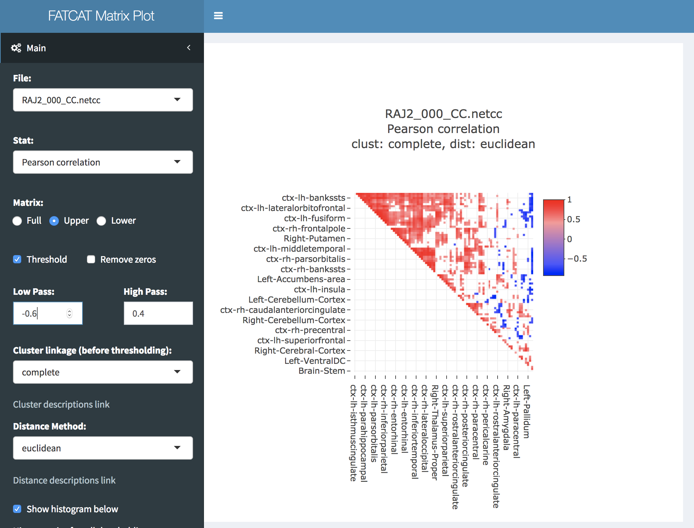

.. _tutorial_FATCAT_matplot_main:

**FATCAT Matplot**
========================================

.. contents:: :local:
    :depth: 2

Ready, ready, ready, ready, ready to run [#f1]_
-----------------------------------------------

#. Make sure AFNI and R are installed and configured correctly.
    `See installation
    <https://afni.nimh.nih.gov/pub/dist/doc/htmldoc/background_install/main_toc.html>`_.
#. Run ``@afni_R_package_install -shiny -circos`` to install necessary R libraries.
#. Process some data with `FATCAT <https://afni.nimh.nih.gov/pub/dist/doc/htmldoc/FATCAT/main_toc.html>`_ or `3dNetcorr <https://afni.nimh.nih.gov/pub/dist/doc/program_help/3dNetCorr.html>`_.
#. Put the output .grid or .netcc datasets in some folder.

Gotta get up to get down [#f2]_
--------------------------------

| Launch FATCAT matplot from the terminal with:
|
| ``@FATCAT_matplot ~/my_Netcc_files``
|
| With "~/my_Netcc_files" being some folder with .netcc or .grid files.
| This will open your default web browser and read all valid datasets in ~/my_Netcc_files

Walking in your footsteps [#f3]_
--------------------------------

Dataset Selector
++++++++++++++++

.. topic:: All valid datasets in the chosen folder are listed in this drop down selector:

    .. figure:: media/FATCAT_matplot_file_picker_edit.png
        :width: 80%
        :align: left

    The selected dataset will be read in and parsed.
    If there are a lot of regions and statistics, a progress bar will be displayed.
    The first statistic in the dataset will be automatically loaded and displayed.

Statistic Selector
++++++++++++++++++

.. topic:: All statistics in the selected dataset are listed in this drop down selector:

    .. figure:: media/FATCAT_matplot_stat_picker.png
        :width: 80%
        :align: left

    The statistics for FATCAT might be FA, bundle length, number of tracks, etc.
    For 3dNetCorr, they could be Pearson correlation, Fisher Z-score, etc.

ROI Selector
++++++++++++

.. topic:: Include/exclude ROIs:

    +-------------------------------------------------+------------------------------------------------------+
    | All ROIs selected by default:                   | Multi-select any combination of ROIs:                |
    +-------------------------------------------------+------------------------------------------------------+
    | .. figure:: media/FATCAT_matplot_roi_select.png | .. figure:: media/FATCAT_matplot_roi_select_some.png |
    |    :width: 100%                                 |    :width: 90%                                       |
    |    :align: left                                 |    :align: left                                      |
    +-------------------------------------------------+------------------------------------------------------+

Zoom
++++

.. topic:: Not all ROIs are visible when there are many:

    +-------------------------------------------------+---------------------------------------------+
    | Default shows as many as possible:              | Click and drag to zoom in:                  |
    +-------------------------------------------------+---------------------------------------------+
    | .. figure:: media/FATCAT_matplot_unzoomed.png   | .. figure:: media/FATCAT_matplot_zoomed.png |
    |    :width: 100%                                 |    :width: 100%                             |
    |    :align: left                                 |    :align: left                             |
    +-------------------------------------------------+---------------------------------------------+

Raw Histogram
+++++++++++++

.. topic:: Before any data manipulation:

    +------------------------------------------------+------------------------------------------------+
    | Show histogram of the data:                    | Scroll down:                                   |
    +------------------------------------------------+------------------------------------------------+
    | .. figure:: media/FATCAT_matplot_hist_hide.png | .. figure:: media/FATCAT_matplot_full_hist.png |
    |    :width: 40%                                 |    :width: 80%                                 |
    |    :align: left                                |    :align: left                                |
    +------------------------------------------------+------------------------------------------------+

Triangle
++++++++

.. topic:: Show or hide the upper or lower triangle of the matrix:

    .. figure:: media/FATCAT_matplot_triangle.png
        :width: 80%
        :align: left

    This also hides the diagonal.

Threshold
+++++++++

.. topic:: Threshold the data values in the matrix:

    +---------------------------------------------------------+
    | * Lowpass keeps anything below the selected value.      |
    | * Highpass keeps anything above the selected value.     |
    | * This is automatically filled with *suggested* values. |
    +---------------------------------------------------------+
    | .. figure:: media/FATCAT_matplot_thresh.png             |
    |     :width: 80%                                         |
    |     :align: left                                        |
    +---------------------------------------------------------+

    +------------------------------------------------------------------+
    | * The histogram will update with the values *after* thresholding.|
    +------------------------------------------------------------------+
    | .. figure:: media/FATCAT_matplot_thresh_hist.png                 |
    |   :width: 50%                                                    |
    |   :align: left                                                   |
    +------------------------------------------------------------------+

Remove Zeros
++++++++++++

.. topic:: Only makes sense for some datasets and statistics:

    +-------------------------------------------------+---------------------------------------------------+
    | With zeros:                                     | Zeros removed:                                    |
    +-------------------------------------------------+---------------------------------------------------+
    | .. figure:: media/FATCAT_matplot_with_zeros.png | .. figure:: media/FATCAT_matplot_remove_zeros.png |
    |    :width: 100%                                 |    :width: 100%                                   |
    |    :align: left                                 |    :align: left                                   |
    +-------------------------------------------------+---------------------------------------------------+

Clustering
++++++++++

.. topic:: Hierarchical cluster analysis reorders the regions:

    +----------------------------------------------------+-------------------------------------------------+
    | No clustering:                                     | Complete linkage with Euclidean distance:       |
    +----------------------------------------------------+-------------------------------------------------+
    | .. figure:: media/FATCAT_matplot_no_clustering.png | .. figure:: media/FATCAT_matplot_clustering.png |
    |    :width: 90%                                     |    :width: 100%                                 |
    |    :align: left                                    |    :align: left                                 |
    +----------------------------------------------------+-------------------------------------------------+

    * Cluster linkage and distance method details are at the links below the drop down selectors.
    * `Hierarchical clustering details <https://stat.ethz.ch/R-manual/R-devel/library/stats/html/hclust.html>`_
    * `Distance method details <https://stat.ethz.ch/R-manual/R-devel/library/stats/html/dist.html>`_

Log Files
+++++++++

.. topic:: Download .csv file with the edited matrix and editing parameters:

    +-------------------------------------------+----------------------------------------------+
    | Save selections and output matrix values: | .csv output with header:                     |
    +-------------------------------------------+----------------------------------------------+
    | .. figure:: media/FATCAT_matplot_log.png  | .. figure:: media/FATCAT_matplot_log_csv.png |
    |    :width: 70%                            |    :width: 100%                              |
    |    :align: left                           |    :align: left                              |
    +-------------------------------------------+----------------------------------------------+

Colors
++++++

.. topic:: Editing colors:

    +---------------------------------------------+---------------------------------------------------+
    | Defaults to 3 different colors:             | Select with color picker:                         |
    +---------------------------------------------+---------------------------------------------------+
    | .. figure:: media/FATCAT_matplot_colors.png | .. figure:: media/FATCAT_matplot_color_picker.png |
    |    :width: 100%                             |    :width: 90%                                    |
    |    :align: left                             |    :align: left                                   |
    +---------------------------------------------+---------------------------------------------------+

    +--------------------------------------------------+-------------------------------------------------------+
    | No edit to min/max leaves data as is:            | Histogram is of the actual data:                      |
    +--------------------------------------------------+-------------------------------------------------------+
    | .. figure:: media/FATCAT_matplot_pre_min_max.png | .. figure:: media/FATCAT_matplot_pre_min_max_hist.png |
    |    :width: 100%                                  |    :width: 70%                                        |
    |    :align: left                                  |    :align: left                                       |
    +--------------------------------------------------+-------------------------------------------------------+

    +---------------------------------------------------+--------------------------------------------------------+
    | Editing the min/max changes the data:             | Histogram shows edited data:                           |
    +---------------------------------------------------+--------------------------------------------------------+
    | .. figure:: media/FATCAT_matplot_post_min_max.png | .. figure:: media/FATCAT_matplot_post_min_max_hist.png |
    |    :width: 100%                                   |    :width: 70%                                         |
    |    :align: left                                   |    :align: left                                        |
    +---------------------------------------------------+--------------------------------------------------------+

    * Changes the color bar range by changing the data.
    * Any value below the chosen minimum will be set to the chosen minimum.
    * Any value above the chosen maximum will be set to the chosen maximum.
    * In this example, any values > 200 are now changed to 200.

    +------------------------------------------------------+
    | This will also effect the log output:                |
    +------------------------------------------------------+
    | .. figure:: media/FATCAT_matplot_min_max_warning.png |
    |    :width: 50%                                       |
    |    :align: left                                      |
    +------------------------------------------------------+

Download Heatmap
++++++++++++++++

.. topic:: Heatmap as .png:

    +-----------------------------------------------------+--------------------------------------------------+
    | Download with dendrogram from clustering:           | May take a few seconds to render with many ROIs: |
    +-----------------------------------------------------+--------------------------------------------------+
    | .. figure:: media/FATCAT_matplot_heatmap_png.png    | .. figure:: media/o.OME1_000.grid_NT_heatmap.png |
    |    :width: 70%                                      |    :width: 100%                                  |
    |    :align: left                                     |    :align: left                                  |
    +-----------------------------------------------------+--------------------------------------------------+

    * May want higher DPI for posters or publications.
    * Image size is fixed at 20x20 inches. (post to the message board if you want it variable)

Download Circos
+++++++++++++++

.. topic:: Circos as .png:

    +-----------------------------------------------------+--------------------------------------------------+-------------------------------------------+
    | Download with dendrogram from clustering:           | May take a few seconds to render with many ROIs: | Looks better with fewer connections:      |
    +-----------------------------------------------------+--------------------------------------------------+-------------------------------------------+
    | .. figure:: media/FATCAT_matplot_circos_png.png     | .. figure:: media/o.OME1_000.grid_NT_circos.png  | .. figure:: media/REST_corr_rz_circos.png |
    |    :width: 50%                                      |    :width: 100%                                  |    :width: 130%                           |
    |    :align: left                                     |    :align: left                                  |    :align: left                           |
    +-----------------------------------------------------+--------------------------------------------------+-------------------------------------------+

    * ROI labels with many characters may need a larger image size.
    * The color picker alpha slider works for the circos plots transparency.
    * Clustering will reorder the ROIs around the circle.
    * For a custom order around the circle, the input data should be reordered.

.. rubric:: Footnotes

.. [#f1] Dixie Chicks
.. [#f2] George Micheal (Fastlove). Original: Brass Construction
.. [#f3] The Police
