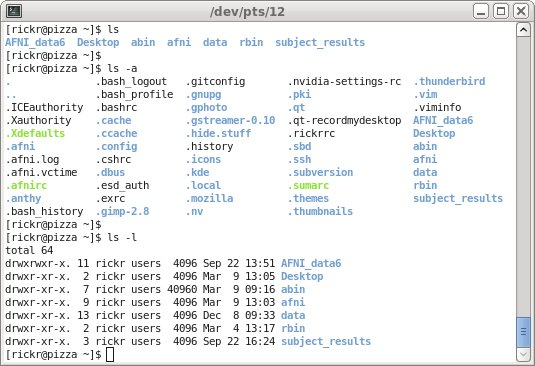
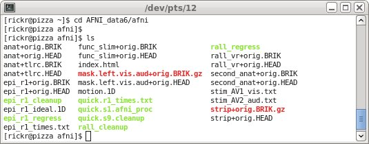
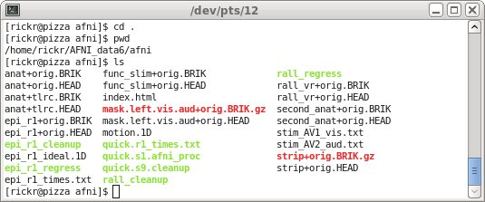
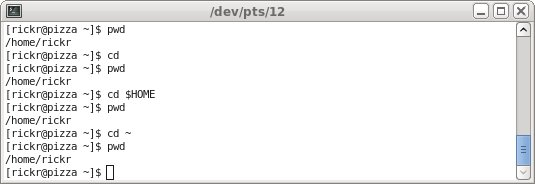
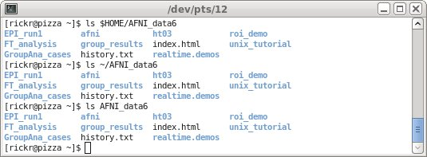
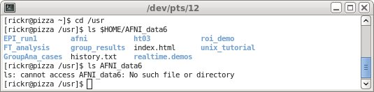

.. _U_basic_1:

****************************
Basic Unix : basic commands
****************************
Basic commands and the :envvar:`$HOME` variable

   Commands and descriptions:

   - :ref:`U_mc_cd` : change directories
   - :ref:`U_mc_ls` : list directory contents
   - :ref:`U_mc_pwd` : show the Present Working Directory
   - :ref:`U_mc_echo` : echo given text to the terminal window

In a terminal window, go to the :envvar:`$HOME` directory.

The :command:`cd` command (without any arguments) will do this.

view $HOME directory
--------------------

   1. go to the :envvar:`$HOME` directory
   2. display the present working directory
   3. echo the value of the :envvar:`$HOME` variable
   4. list the basic contents of that directory

   commands (type these in the terminal window)::

        cd
        pwd
        echo $HOME
        ls

The output for this will vary, since home directories and contents vary.

.. image:: media/basic_1_A.jpg
   :align: center
   :width: 80%

.. note:: My terminal prompt looks like ``[rickr@pizza DIR]$``, where `DIR`
          is the current directory.

There is no output from a :command:`cd` command (except for perhaps a change in the prompt).  The output from :command:`pwd` should show the path to the user's home directory (as will the output from 'echo $HOME), while the output from :command:`ls` should include AFNI_data6.

the :command:`ls` command
-------------------------
Compare the simple listing of files with the listing of all files and the long-format listing.  Just for fun, try both options.

   commands (type these in the terminal window)::

        ls
        ls -a
        ls -l

The output for this will vary, since home directories and contents vary, but it might look like:

The :command:`ls` command should show the same files and directories as above, including AFNI_data6.

With the -a option, all files (and directories) are shown, including those starting with a '.' (which includes '.' and '..', the current and parent directories).  There is nothing special about such files, except that they are named starting with '.'.  They are typically configuration files for various programs (such as .afnirc for AFNI programs and .sumarc for SUMA programs).

The -l option is to show a "long" listing, including permissions, ownership, file size, modification date and the file name.

go to AFNI_data6
----------------
Move into the AFNI_data6/afni director and see what is there.

   commands (type these in the terminal window)::

        cd AFNI_data6/afni
        pwd
        ls
        ls -al

There are anatomical, EPI, statistical and mask datasets here, along with scripts (text files of commands, such as rall_regress) and stimulus timing files (text files of times in seconds, such as stim_AV1_vis.txt).

Again, the -al options show all files and using a long format.  Note that the list starts with '.' and '..' at the top.

The output might look like the following (`ls -al` is omitted, just because it is long).

go nowhere
----------
Change to directory '.' (the current directory).  This accomplishes nothing.

   commands (type these in the terminal window)::

        cd .
        pwd
        ls
        ls -al

Since '.' is the current directory, "cd ." says to move to where we already are.  This is not a practical example, but hopefully makes it clear at least what the '.' represents.

Again, `ls -al` is omitted from the output.

go up
-----
Change to the directory '..' (the parent directory), going up one level.

   commands (type these in the terminal window)::

        cd ..
        pwd
        ls
        ls -al

Since we had been in the AFNI_data6/afni directory, we have now moved into the AFNI_data6 directory.  So among other things, we see that there is an 'afni' directory here, which is where we just came from.

The complete output might look like this.

.. image:: media/basic_1_E.jpg
   :align: center
   :width: 80%

go :command:`$HOME`
-------------------
Go to the :envvar:`$HOME` directory in various ways.  Each `cd` command would take on to their :envvar:`$HOME` directory.

   commands (type these in the terminal window)::

        pwd
        cd
        pwd
        cd $HOME
        pwd
        cd ~
        pwd

The :command:`pwd` commands are just to verify where we are each time.  But any of the :command:`cd` will go to the home directory.

   =========   ===============================================================
   command     description
   =========   ===============================================================
   cd          without any options, cd goes to the home directory
   cd $HOME    $HOME means our home directory, e.g. /home/rickr or /Users/rickr
   cd ~        the '~' character also means our home directory
   =========   ===============================================================

The output might look like this.  Each time `pwd` shows `/home/rickr` (since that is my :envvar:`$HOME` directory).

lots of :command:`ls`
---------------------
Understand absolute and relative pathnames.

   commands (type these in the terminal window)::

        cd

        ls
        ls .
        ls $HOME

        ls $HOME/AFNI_data6
        ls ~/AFNI_data6
        ls AFNI_data6

        cd /usr
        ls $HOME/AFNI_data6
        ls AFNI_data6

An absolute pathname is simply one starting with '/', while a relative pathname does not.  One can find an absolute pathname easily: start at the initial root directory '/', and follow the path downward.  A relative path depends on the starting point.  If that is unknown, it may be hard to find.

Use :command:`cd` to start from the :envvar:`$HOME` directory.

Note that 'ls', 'ls .' and 'ls $HOME' have the same output.  They each show the contents of the home directory.  By default, :command:`ls` shows the current directory, which is exactly what 'ls .' says, only by using '.' as the relative path to the current directory (as opposed to '..' being the relative path to the parent directory).

.. image:: media/basic_1_G1.jpg
   :align: center
   :width: 80%

More interestingly, the second set of 3 commands shows the contents of the AFNI_data6 directory.  Since both ``~`` and :envvar:`$HOME` evaluate to /home/rickr (or whatever your home directory is), the first 2 examples are identical using absolute paths.  While the third uses a relative path, and relies on being just above AFNI_data6 (i.e. sitting in :envvar:`$HOME`).

Note that to display the contents of AFNI_data6, the absolute path method will work from anywhere (one can :command:`cd` to any directory in the filesystem, and 'ls $HOME/AFNI_data6' will still work).  But for the relative path example to work, one must start from the correct location.

The final set of 3 commands simply demonstrates this in one more way.  From the /usr directory, 'ls $HOME/AFNI_data6' still works, but 'ls AFNI_data6' does not.  There is no AFNI_data6 directory under /usr, the following error results:

         AFNI_data6: No such file or directory

.. note::
        - Get in the habit of using ``ls`` after any ``cd`` command,
          i.e. see what is in any directory that you enter.
        - The ``echo`` command is mostly used in processing scripts, to
          inform the user of something.

